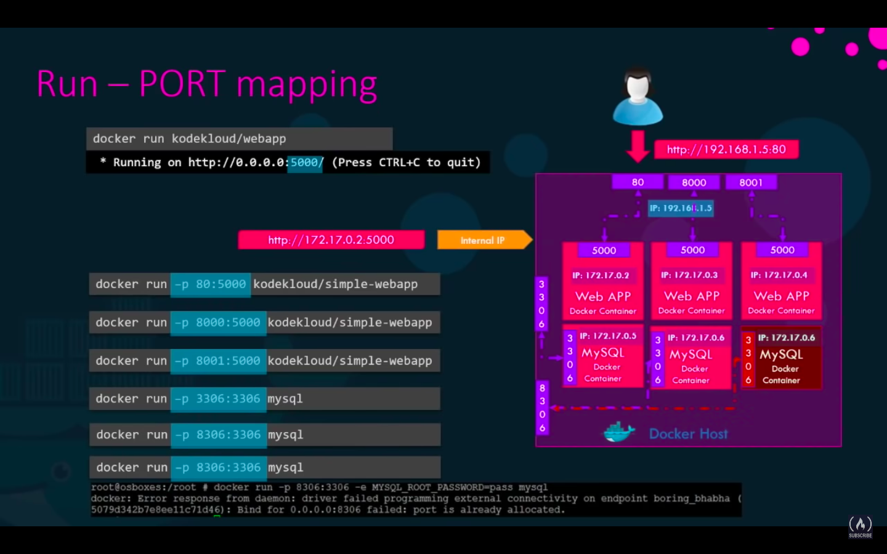

### Refferances:

-   [Docker and Kubernetes Complete Tutorial](https://www.youtube.com/playlist?list=PL0hSJrxggIQoKLETBSmgbbvE4FO_eEgoB)
-   [Dockerfile Components](https://github.com/wsargent/docker-cheat-sheet#dockerfile)
-   [Docker Commands Cheat Sheet](https://buddy.works/tutorials/docker-commands-cheat-sheet#docker-container-commands)
-   [Docker Cheat Sheet](https://intellipaat.com/blog/tutorial/devops-tutorial/docker-cheat-sheet/)
-   [The Docker Handbook – 2021 Edition](https://www.freecodecamp.org/news/the-docker-handbook/)
    -   [the-docker-handbook](https://github.com/fhsinchy/the-docker-handbook)

### Troubleshooting:

-   [unix:///var/run/docker.sock](https://www.youtube.com/watch?v=FcZ1Dh3X5JQ)

### [Install Docker Engine on Linux](https://docs.docker.com/engine/install/ubuntu/)

-   [How to use Docker on CentOS 7](https://www.digitalocean.com/community/tutorials/how-to-install-and-use-docker-on-centos-7)
-   [Install using the repository](https://docs.docker.com/engine/install/ubuntu/#install-using-the-repository)
-   [Install using the convenience script](https://docs.docker.com/engine/install/ubuntu/#install-using-the-convenience-script)

-   `$ sudo systemctl status docker` → Check whether Docker is running or not in Linux machine.

-   `$ docker --version`
-   `$ docker version`
-   `$ docker-compose --version`
-   `/var/lib/docker/`
    -   `/aufs`
    -   `/containers`
    -   `/image`
    -   `/volumes`
-   `$ docker info`
-   `$ sudo service docker status`
-   `$ systemctl is-active docker`
<details>
<summary style="font-size:25px;color:Orange;text-align:left">Terminology</summary>

-   [Glossary](https://docs.docker.com/glossary/)
-   Attach Mode: In the attached mode, Docker can start the process in the container and attach the console to the process’s standard input, standard output, and standard error.When you run a Docker run command, it runs in the foreground or in an attached mode, meaning you will be attached to the console or the standard out of the Docker container. And you will see the output of the web service on your screen. You won't be able to do anything else on this console other than view the output until this Docker container stops. It won't respond to your inputs. press the `ctrl+c` combination to stop the container and the application hosted on the container exits and you get back to your prompt.
-   Detach Mode: Detach mode started by the option `--detach` or `–d` flag in docker run command, means that a Docker container runs in the background of your terminal. It does not receive input or display output. Using detached mode also allows you to close the opened terminal session without stopping the container. The container will continue to run in the backend, run the docker ps command to view the running container. Now if you would like to attach back to the running container later, run the `docker attach con_id/con_name` command and specify the name or ID of the Docker container.
-   Context:
-   Build Stage:
-   Layer: A layer is modification to the image, represented by an instruction in the Dockerfile. Layers are applied in sequence to the base image to create the final image. When an image is updated or rebuilt, only layers that change need to be updated, and unchanged layers are cached locally. This is part of why Docker images are so fast and lightweight. The sizes of each layer add up to equal the size of the final image.

-   Volumes:
    -   Named Volumes: are user-defined volumes that are managed by Docker and can be created, backed up, and migrated. Named volumes can be created using the docker volume create command and mounted into containers using the --mount or -v flag. Named volumes are stored on the host file system, but their location can be specified using the --mount-path option.
    -   Anonymous Volumes: are created automatically when a container is created with the --mount or -v flag, without specifying a named volume. Anonymous volumes are not managed by Docker and their contents are lost when the container is deleted. Anonymous volumes are useful for testing and debugging, but not recommended for production use.
    -   In summary, named volumes are a better choice for production use, as they provide a way to manage and persist data, while anonymous volumes are useful for testing and debugging, but should not be used for production data.
-   Mounts (There are mainly two types of Mounts):
    -   Bind Mounts: allows you to mount a host file or directory into a container. The host file or directory is mounted directly into the container's file system and changes made to the mounted file or directory are reflected in both the host and container file systems.
    -   Volume Mounts: creates a new, dedicated directory in the Docker host's file system that is managed by Docker. Data stored in a volume is persistently stored and is not tied to the life cycle of the container. The data in the volume can be shared among multiple containers and can be backed up or migrated.
    -   Both types of mounts are useful for different purposes. Bind mounts are often used for development purposes where you need to quickly mount a host directory into a container for testing or debugging. Volume mounts are useful for storing data that needs to persist, even if the container is deleted or recreated.

</details>

<details open>
<summary style="font-size:25px;color:Orange;text-align:left">docker</summary>

-   [docker](https://docs.docker.com/engine/reference/commandline/docker/) | [Use the Docker command line](https://docs.docker.com/engine/reference/commandline/cli/)

-   [$ docker build](https://docs.docker.com/engine/reference/commandline/build/): `docker build [OPTIONS] PATH | URL | -`

    -   `$ docker build -t image_name .`
        -   The `-t` flag is used to tag the new built image by the image-name of "image_name". The `.` is used to indicate that the Dockerfile is in the current directory (`.`), along with so-called “context” — that is, the rest of the files that may be in that location
    -   `$ docker run -dit --rm -v /Volumes/GoogleDrive/My\ Drive/gd/Software_Development/notes_hub/dotfiles/Linux:/root --name=rhel8 roboxes/rhel8 sleep 9000`

-   [docker run](https://docs.docker.com/engine/reference/commandline/run/): `docker run [OPTIONS] IMAGE [COMMAND] [ARG...]`

    ```bash
    docker run -dit --rm \
    -e WORKING_DIR=/User/a.momin/Data \     # Set environment variables
    -w /code \                              # Working directory inside the container
    -p 8010:8012 \                          # Publish a container's port(s) to the host
    --expose 80 \                           # Expose a port or a range of ports
    --read-only -v /icanwrite \             # Mount the container's root filesystem as read only
    -v `pwd`:`pwd` \
    -v /doesnt/exist:/foo \                 # Docker will automatically create this directory on the host if a bind-mounted volume doesn’t exist.
    --read-only --mount type=volume,target=/icanwritetoo \
    --mount type=bind,src=/data,dst=/data \
    -w `pwd` \
    --entrypoint sleep                      # overridding entrypoint with bash command `sleep`
    --network=network_name \
    --name=container_name \
    image_name:latest param1                # Append parameter `param1` to entrypoint bash command (`sleep param1`)
    ```

-   `$ docker inspect container_name` → Inspect the created contaner named by `container_name`

-   `$ docker run -d --name=name_your_container <image_name>`

    -   Pull image_name down if it's not available in docker-host (Local Machine) and instantiate and run an image_name_container from image_name image.
    -   Run in _Attach Mode_. Add `-d` option to run in _Detach Mode_
    -   `--name=name_your_container` is used to give the container a name to refer it later
    -   EX: `$ docker run nginx`.

-   `$ docker pull <image_name>` → Just pull down the image into the docker-host (Local machine) form docker registry (Docker Hub)

-   `Run - STDIN`:

    -   `$ docker run -it <image_name>` → Run in interactive (`i`) mode with terminal (`t`) aatched to it.
    -   `$ docker run python:3.7`

-   `Run - PORT Mapping`:
    -   `$ docker run -it 80:5000 dockerized_flask_app/app`



-   Run - VOLUME Mapping:

    -   `$ docker run -v /dir_out_container:/dir_in_container mysql`

-   Inspect a Container:

    -   `$ docker inspect <container_name | container_id>` → Return details of a container in json format.

-   Container Logs:

    -   `$ docker logs <container_name | container_id>` → Show the logs of a container ran in backgroun (detach mode).
    -   `$ docker logs -f <container_name | container_id>` → Show the logs of a container ran in backgroun (detach mode) with `-f` (--follow) following log output.
    -   `$ docker attach <container_id>` → Run (without `-d` option) in _Attach Mode_ back.

-   [$ docker ps](https://docs.docker.com/engine/reference/commandline/ps/): `docker ps [OPTIONS]`

    -   `$ docker ps` → list out only the running containers
    -   `$ docker cp ./<my_new_dag.py> dagvaol_host:/dags` → Copy my_new_dag.py from CWD to allocated dag volume in the docker container.
    -   `$ docker ps --format "table {{.Names}}:\t{{.Ports}}\t{{.Status}}"` → Print the result of `docker pa` in the given format.

-   [$ docker stop](https://docs.docker.com/engine/reference/commandline/stop/): `docker stop [OPTIONS] CONTAINER [CONTAINER...]`

    -   `$ docker stop <container_id | container_name>` → Stop the given running container keeping the instance of the container for later use.

-   [$ docker kill](https://docs.docker.com/engine/reference/commandline/kill/): `docker kill [OPTIONS] CONTAINER [CONTAINER...]`
    -   The docker kill subcommand kills one or more containers. The main process inside the container is sent SIGKILL signal (default), or the signal that is specified with the --signal option. You can reference a container by its ID, ID-prefix, or name. While the default (SIGKILL) signal will terminate the container, the signal set through --signal may be non-terminal, depending on the container’s main process. For example, the SIGHUP signal in most cases will be non-terminal, and the container will continue running after receiving the signal.
-   [$ docker rm](): ``

    -   `$ docker rm <container_id | container_name>` → Remove the instance of container previously created.
    -   `$ docker images` → List out images available in docker host (local machine or remote server)

    -   `$ docker rmi <image_name>`
        -   Remove the image_name previously build or pulled down from docker registry.
        -   EX: `$ docker rmi nginx`.
        -   Must not running any container of that image.

-   Runing Special UBUNTU Image:

    -   When you run the Docker run Ubuntu command it runs an instance of Ubuntu image and exits immediately.
    -   Now why is that? Unlike virtual machine containers are not meant to host an operating system. Containers are meant to run a specific task or process such as to host an instance of a web server or application server or a database, or simply to carry some kind of computation or analysis task. Once the task is complete, the container exits. A container only lives as long as the process inside it is alive. If the web service inside the container is stopped, or crash, then the container exits.

    -   `$ docker run ubuntu` → Runs an Ubuntu image and it exites immediately.

        -   `$ docker ps`

    -   `$ docker run ubuntu sleep 60`

        -   `$ docker ps`

    -   `$ docker run ubuntu sleep 5`
        -   Start container with a command `sleep 5`
    -   `$ docker `
    -   `$ docker `

-   [$ docker exec](https://docs.docker.com/engine/reference/commandline/exec/): `docker exec [OPTIONS] CONTAINER COMMAND [ARG...]`

    -   `$ docker exec -it <container_id | container_name> bash` → This command is used to access the running container
    -   `$ docker exec -it -u 0 <container_id | container_name> bash` → This command is used to access the running container as a root user.

-   [$ docker image](): ``

    -   `docker images` → List our images
    -   `$ docker image tag image_name new_image_name` → Take the backup of image_name by new name `new_image_name`

-   `$ docker pull image_name` - Just pull the image from docker registry but don't run it.

-   `$ docker cp . volume_name:folder_name`
    -   Copy content of current directory in the `folder_name` of `volume_name`.

<details open>
<summary style="font-size:25px;color:Orange;text-align:left">docker network</summary>

-   [docker network](https://docs.docker.com/engine/reference/commandline/network/)
-   `$ docker network COMMAND`
-   `$ docker network create [OPTIONS] NETWORK`
-   `$ docker network ls [OPTIONS]`
-   `$ docker network inspect [OPTIONS] NETWORK [NETWORK...]`
-   `$ docker network rm NETWORK [NETWORK...]`
-   `$ docker network prune [OPTIONS]`
    -   Remove all unused networks. Unused networks are those which are not referenced by any containers.
-   `$ `

</details>

<details open>
<summary style="font-size:25px;color:Orange;text-align:left">docker volume</summary>
-   [Add bind mounts, volumes or memory filesystems](https://docs.docker.com/engine/reference/commandline/service_create/#add-bind-mounts-volumes-or-memory-filesystems)

-   `$ docker volume create [OPTIONS] [VOLUME]`
-   `$ docker volume create [OPTIONS] [VOLUME]`
-   `$ docker volume ls [OPTIONS]`
-   `$ docker volume inspect [OPTIONS] VOLUME [VOLUME...]`
-   `$ docker volume rm [OPTIONS] VOLUME [VOLUME...]`
-   `$ docker volume prune [OPTIONS]`
    -   Remove all unused local volumes. Unused local volumes are those which are not referenced by any containers
-   `$ `

</details>

</details>

---

<details open>
<summary style="font-size:25px;color:Orange;text-align:left">docker-compose</summary>

## Docker Compose:

-   [Using Volume in Docker Compose](https://devopsheaven.com/docker/docker-compose/volumes/2018/01/16/volumes-in-docker-compose.html)

---

-   [docker-compose](https://docs.docker.com/compose/reference/):

-   [Compose CLI environment variables](https://docs.docker.com/compose/reference/envvars/)

-   `$ docker-compose down` →
-   `$ docker-compose up --build` → It builds the image before getting up.
-   `$ docker-compose up -d` → It just spin up the container assuming the image is built already.
-   `$ docker-compose build` → It just build the image.
-   `$ docker-compose ` →

### [$ ](): ``

### [$ ](): ``

</details>

---

<details>
<summary style="font-size:25px;color:Orange;text-align:left">Miscellaneous</summary>

## Rough:

-   `$ docker commit`

    -   docker commit <conatainer_id> <username/imagename>

    -   This command creates a new image of an edited container on the local system

### Run Container:

-   `$ docker run <image name>`

    -   `$ docker run hello-world`

-   Although this is a perfectly valid command, there is a better way of dispatching commands to the docker daemon.
-   Prior to version 1.13, Docker had only the previously mentioned command syntax. Later on, the command-line was restructured to have the following syntax:

-   `$ docker <object> <command> [options] [...]`

    -   `object` indicates the type of Docker object you'll be manipulating. This can be a `container`, `image`, `network` or `volume` object.
    -   `command` indicates the task to be carried out by the daemon, for instance, the run command.
    -   `options` can be any valid parameter that can override the default behavior of the command, like the `--publish` option for port mapping.

    -   `$ docker container run -d <image_name>`
    -   `$ docker container run --detach --publish 8080:80 fhsinchy/hello-dock`
    -   `$ docker volume create volume_my_data`
    -   `$ docker network create --drive bridge --subnet 128.18.0.0/16 custom_isolated_network`

    -   `--publish (-p) 8080:80` indicates that any request sent to port 8080 of your host system will be forwarded to port 80 inside the container‌.
    -   `--detach (-d)` option is provided to keep container running without terminal to keep running .
    -   One thing that you have to keep in mind in case of the run command is that the image name must come last. If you put anything after the image name then that'll be passed as an argument to the container entry-point (explained in the [Executing Commands Inside a Container]() sub-section) and may result in unexpected situations.

-   `$ ctrl + c`

-   `$ docker container ls`

    -   List out containers that are currently running.

-   `$ docker container ls --all`

    -   List out containers that are currently running and were run in past.

-   `$ `
-   `$ docker ps -a`
    -   List all the containers that are currently running or have run in the past.

### Stop/kill Container:

-   `$ docker container stop <container_identifier>`
-   `$ docker container kill <container_identifier>`

    -   If you use the name as identifier, you'll get the name thrown back to you as output. The stop command shuts down a container gracefully by sending a SIGTERM signal. If the container doesn't stop within a certain period, a SIGKILL signal is sent which shuts down the container immediately.
    -   In cases where you want to send a SIGKILL signal instead of a SIGTERM signal, you may use the container kill command instead. The container kill command follows the same syntax as the stop command.

-   `$ `

### Restart/Reboot Container:

-   Restart: The container which were previously stoped or killed
-   Reboot: The container which are currently running.

-   `$ docker container start <container_identifier`

    -   The container start command can be used to start any stopped or killed container.
    -   The container start command starts any container in detached mode by default and retains any port configurations made previously.

-   `$ docker container restart <container_identifier`

-   The main difference between the two commands is that the container restart command attempts to stop the target container and then starts it back up again, whereas the start command just starts an already stopped container.
-   In case of a stopped container, both commands are exactly the same. But in case of a running container, you must use the container restart command.

### docker-compose:

-   `$ docker-compose build`
-   `$ docker-compose up -d`
-   `$ docker-compose down`

### Docker Volume:

-   Anonymous: Randomly created and maintained by Docker.
-   Host: Mount a local directory or file on the container
-   Named: Created with a name and maintaied by Docker

### Usefull Commands in case of non-responsive Dockers in RHEL

-   ps -auxwww | head -n1
-   cat sos_commands/process/ps_auxwww | awk '$8 ~ /D/'
-   echo 1 > /proc/sys/kernel/sysrq
-   echo w > /proc/sysrq-trigger

</details>

<details>
<summary style="font-size:25px;color:Orange;text-align:left"> Dockerfile </summary>

-   [Dockerfile sample for Jupyter notebook images](https://www.ibm.com/docs/en/cloud-paks/cp-data/4.5.x?topic=image-dockerfile-sample-jupyter-notebook-images)
-   [Dockerfile Components](https://github.com/wsargent/docker-cheat-sheet#dockerfile)

`FROM`: sets the base image for the build process
`LABEL`: adds metadata to the image in the form of key-value pairs
`ENV`: sets an environment variable. ENV - sets an environment variable that will persist in the final image. The value of an ENV variable can be referenced in the Dockerfile using $VAR_NAME syntax and can be used to configure the behavior of applications or scripts running in the container. The value of an ENV variable can also be overridden at runtime using the -e flag when running the container.
`ARG`: sets a build-time argument with a default value. ARG - is used to define a variable that can be passed at build-time using the --build-arg flag. The value of an ARG variable can be changed for each build, and the variable is not persisted in the final image. ARG variables are often used to specify image configuration parameters that can be adjusted without changing the Dockerfile.
`COPY <src> <dest>`: It is a simple instruction that only supports copying files or directories from the host file system into the image. The COPY instruction is faster than ADD, as it does not perform any additional functionality like URL extraction or decompression.
`ADD <src> <dest>`: .It is a more versatile instruction that supports copying files or directories from the host file system into the image, as well as extracting tar archives and decompressing gzip files.
`EXPOSE`: exposes one or more ports for external access. The purpose of the EXPOSE instruction in a Dockerfile is to inform the user and other containers about the network ports that the container listens on. When you specify the EXPOSE instruction in your Dockerfile, you are declaring the ports that the container will use for communication. The EXPOSE instruction does not actually publish the ports, it simply provides information about the ports to the user and other containers. To make the exposed ports accessible from the network, you need to use the -p or --publish flag when running the container, which maps the container's exposed ports to ports on the host machine.
`HEALTHCHECK`: specifies how to check the health of the container
`ONBUILD`: triggers a command when the image is used as the base for another build
`RUN`: runs a command in a new layer on top of the current image
`SHELL`: sets the default shell to use for commands specified in RUN, CMD, and ENTRYPOINT
`STOPSIGNAL`: sets the system call signal that will be sent to the container to exit
`VOLUME`: creates a mount point for data volumes in the container
`USER`: sets the UID (user ID) or username that will run the command specified in CMD, ENTRYPOINT, and RUN
`WORKDIR`: sets the working directory for subsequent instructions
`ENTRYPOINT`: specifies the command to run when the container starts and cannot be overridden from the command line
`CMD`: specifies the command to run when the container starts

</details>
