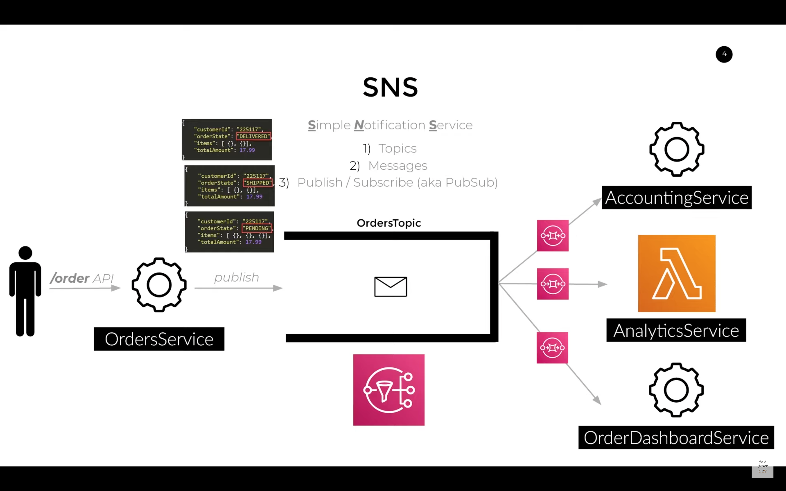
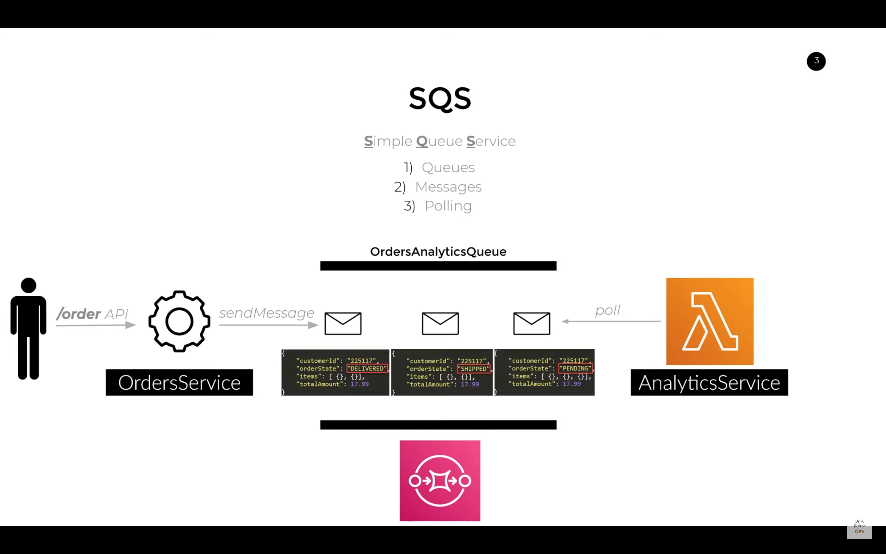
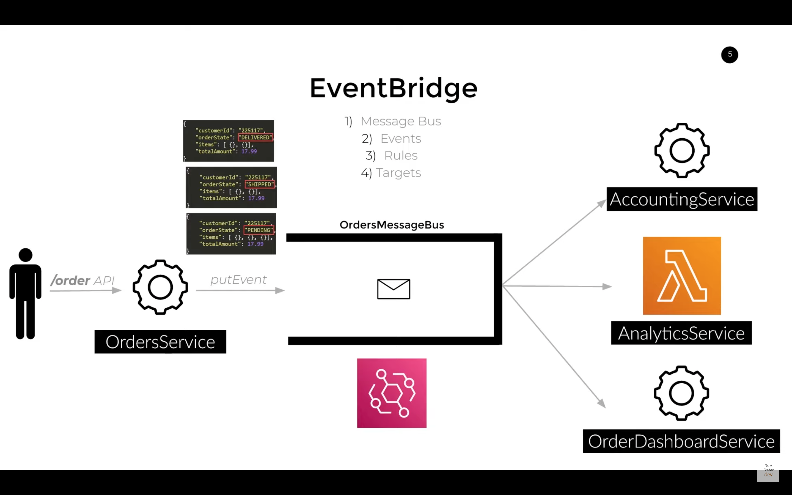

### [AWS Documentations](https://docs.aws.amazon.com/index.html)

-   [How To Learn AWS? Starting Points for Devops, Frontend, Backend, and DE Career Paths](https://www.youtube.com/watch?v=N8lcedBPmE8)
-   [The Most Important AWS Core Services That You NEED To Know About!](https://www.youtube.com/watch?v=B08iQQhXG1Y)

<details open><summary style="font-size:15px;color:Magenta;text-align:left">AWS CLI</summary>

-   Configure Files:

    -   `~/.aws/config`
    -   `~/.aws/credentials`

-   `$ aws configure list`
-   `$ aws configure get property_name [--profile profile_name]`
-   `$ aws configure get aws_access_key_id`
-   `$ aws configure get region --profile ht`
-   `$ aws configure get output --profile ht`
-   `$ aws configure set property_name value [--profile profile_name]`
-   `$ aws configure set aws_access_key_id YOUR_ACCESS_KEY`
-   `$ aws configure set default.region us-east-2` -> aws configure set <varname> <value> [--profile profile-name]
-   `$ aws iam list-users` -> If you've just one profile set locally
-   `$ aws iam list-users --profile <profile-name>` -> If you've multiple profiles set locally
-   `$ `
-   `$ `
-   `$ `

</details>

---

<details open><summary style="font-size:15px;color:Magenta;text-align:left">Confusing Concepts</summary>

-   [The Most Important AWS Core Services That You NEED To Know About!](https://www.youtube.com/watch?v=B08iQQhXG1Y)

##### Services vs Resources:

-   AWS Services refer to the various offerings and capabilities provided by Amazon Web Services, such as Amazon S3 (Simple Storage Service), Amazon EC2 (Elastic Compute Cloud), AWS Lambda, Amazon RDS (Relational Database Service), Amazon SQS (Simple Queue Service), and many others. Each of these services provides specific functionality, and customers can choose which services they want to use and in what combination, depending on their needs.
-   AWS Resources, on the other hand, refer to specific instances of AWS services that have been created by customers or by other AWS services on their behalf. For example, if a customer creates an EC2 instance, that instance is an AWS resource. Similarly, if a customer creates an S3 bucket, that bucket is an AWS resource.
-   In summary, AWS Services are the various capabilities provided by AWS, while AWS Resources are the specific instances of those services that customers create and manage. Understanding the distinction between these terms is important for effectively using and managing AWS infrastructure.

##### Permission vs Policy

-   a policy is a set of permissions that can be attached to an identity to define its overall access to AWS resources. A policy can include one or more permissions and can be attached to multiple identities. For example, a policy might allow all members of a certain group to access a specific set of EC2 instances.
-   A permission is a statement that grants or denies access to a specific AWS resource or operation. Permissions are attached to an identity, such as a user, group, or role, and specify what actions that identity can perform on the resource. For example, a permission might allow a user to read objects from a specific S3 bucket, but not delete them.

</details>

---

<details open><summary style="font-size:20px;color:Orange;text-align:left">EC2</summary>

-   [DigitalCloud: EC2](https://www.youtube.com/watch?v=8bIW7qlldLg&t=108s)

Amazon Elastic Compute Cloud (Amazon EC2) is a web service provided by Amazon Web Services (AWS) that allows users to rent virtual servers on which they can run their applications. Below are some key terms and concepts associated with AWS EC2:

-   `Instance`: An instance is a virtual server in the cloud. It represents the computing resources (CPU, memory, storage, etc.) that you can rent from AWS. Instances are the fundamental building blocks of EC2.
-   `AMI (Amazon Machine Image)`: An AMI is a pre-configured template used to create instances. It contains the necessary information to launch an instance, including the operating system, application server, and applications.
-   `Instance Types`: Instances come in various types, each optimized for different use cases. Instance types vary in terms of compute, memory, storage, and networking capacity. Examples include t2.micro, m5.large, and c4.2xlarge.
-   `Region`: AWS divides the world into geographic areas called regions. Each region contains multiple Availability Zones. Examples of regions include us-east-1 (North Virginia), eu-west-1 (Ireland), and ap-southeast-2 (Sydney).
-   `Availability Zone (AZ)`: An Availability Zone is a data center or a collection of data centers within a region. Each Availability Zone is isolated but connected to the others. Deploying instances across multiple Availability Zones increases fault tolerance.
-   `Key Pair`: A key pair consists of a public key and a private key. It is used for securely connecting to an EC2 instance. The public key is placed on the instance, and the private key is kept secure.
-   `Security Groups`: Security groups act as virtual firewalls for instances. They control inbound and outbound traffic based on rules that you define. Each instance can be associated with one or more security groups.
-   `Elastic Block Store (EBS)`: EBS provides block-level storage volumes that you can attach to EC2 instances. It is used for data that requires persistent storage. EBS volumes can be used as the root file system or attached to an instance as additional storage.
-   `Elastic Load Balancer (ELB)`: ELB automatically distributes incoming application traffic across multiple EC2 instances. It enhances the availability and fault tolerance of your application.
-   `Auto Scaling`: Auto Scaling allows you to automatically adjust the number of EC2 instances in a group based on demand. It helps maintain application availability and ensures that the desired number of instances are running.
-   `Placement Groups`: Placement groups are logical groupings of instances within a single Availability Zone. They are used to influence the placement of instances to achieve low-latency communication.
-   `Spot Instances`: Spot Instances are spare EC2 capacity that is available at a lower price. You can bid for this capacity, and if your bid is higher than the current spot price, your instances will run. However, they can be terminated if the spot price exceeds your bid.
-   `On-Demand Instances`: On-Demand Instances allow you to pay for compute capacity by the hour or second with no upfront costs. This is a flexible and scalable pricing model suitable for variable workloads.
-   `Reserved Instances`: Reserved Instances offer significant savings over On-Demand pricing in exchange for a commitment to a one- or three-year term. They provide a capacity reservation, ensuring availability.

</details>

---

<details open><summary style="font-size:20px;color:Orange;text-align:left">IAM (Identity and Access Management)</summary>

-   [AWS IAM Core Concepts You NEED to Know](https://www.youtube.com/watch?v=_ZCTvmaPgao)
-   [AWS IAM Guides](https://www.youtube.com/playlist?list=PL9nWRykSBSFjJK9mFrIP_BPWaC0hAL9dZ)

AWS Identity and Access Management (IAM) is a service that allows you to manage access to AWS resources. The following are some key terms and concepts related to IAM:

-   `Entities`: In AWS, an entity refers to any object or resource that can be managed by AWS services. Entities can include a wide variety of resources, including IAM users, EC2 instances, S3 buckets, RDS databases, Lambda functions, and more. AWS entities can be created, configured, and managed using AWS management tools such as the AWS Management Console, AWS CLI, and AWS SDKs. Depending on the type of entity, different AWS services may be used to manage it.
-   `Identity`: In the context of AWS (Amazon Web Services), "identity" refers to the concept of uniquely identifying and authenticating users or entities within the AWS ecosystem.
-   `Users`: IAM users are entities that you create to represent people, applications, or services that need access to AWS resources. Each user has a unique name and credentials.
-   `Groups`: IAM groups are collections of users. You can apply policies to groups to grant or deny access to AWS resources. Instead of assigning permissions directly to individual users, you can assign permissions to groups. This simplifies access management, as you can grant and revoke permissions for multiple users by managing group memberships.
-   `Roles`: IAM roles are similar to users but are intended for use by AWS services, applications, or other AWS accounts. Roles allow you to grant temporary access to resources across different accounts and services without having to create long-term credentials like access keys. IAM roles are a way to delegate permissions to entities that you trust. A role does not have any credentials, but instead, it is assumed by an entity that has credentials. This entity could be an AWS service, an EC2 instance, or an IAM user in another account. IAM roles can be used for a variety of purposes, such as granting permissions to AWS services or resources, allowing cross-account access, or providing permissions to an external identity provider (IdP).
-   `Permissions`: Permissions are the actions that users, groups, and roles are allowed or denied to perform on AWS resources. They are defined by IAM policies.
-   `Policies`: IAM policies are documents that define permissions. They are attached to users, groups, and roles to determine what actions they can perform on AWS resources. A policy is a set of permissions that can be attached to an identity to define its overall access to AWS resources. A policy can include one or more permissions and can be attached to multiple identities. For example, a policy might allow all members of a certain group to access a specific set of EC2 instances.

    -   IAM Policy
    -   Resouece Based Policy
    -   Create Policy usin AWS CLI:

        ```bash
        aws iam create-policy
        --policy-name my-policy
        --policy-document file://policy
        ```

        -   The file `policy` is a JSON document in the current folder that grants read only access to the shared folder in an Amazon S3 bucket named my-bucket:

        ```json
        {
            "Version": "2012-10-17",
            "Id": "default",
            "Statement": [
                {
                    "Sid": "lambda-a75c4b44-4416-4229-91af-350e53bb044c",
                    "Effect": "Allow",
                    "Principal": {
                        "Service": "events.amazonaws.com"
                    },
                    "Action": "lambda:InvokeFunction",
                    "Resource": "arn:aws:lambda:us-east-1:554116157557:function:lambda_canary",
                    "Condition": {
                        "ArnLike": {
                            "AWS:SourceArn": "arn:aws:events:us-east-1:554116157557:rule/canary"
                        }
                    }
                }
            ]
        }
        ```

    -   Common Attributes of AWS Policy Documents:

        -   `Version`: The "Version" field specifies the version of the AWS policy language being used. It is required and indicates the syntax and structure of the policy. The version is typically specified as a date, such as "2012-10-17" or "2016-10-17."
        -   `Id`: The optional "Id" field is used to give a unique identifier to the policy. It is often used for managing and organizing policies in the AWS Management Console.
        -   `Statement`: The "Statement" field is the most important part of an AWS policy document. It contains an array of individual statements, each of which defines a permission or access control rule. A policy can have multiple statements.
        -   `Sid`: The optional "Sid" (Statement ID) field is used to provide a unique identifier for each statement within a policy. It is helpful for referencing or managing specific statements within the policy.
        -   `Effect`: The "Effect" field specifies whether the statement grants ("Allow") or denies ("Deny") permissions. It is a required field in each statement.
        -   `Principal`: The "Principal" field identifies the AWS identity (user, group, role, or AWS service) to which the permissions are granted or denied. It can also specify the **\*** wildcard to apply the permission to all identities.
        -   `Action`: The "Action" field defines the AWS service actions that are allowed or denied by the statement. It can specify a single action or a list of actions. AWS actions are typically named using a combination of the service name and the action name (e.g., "s3:GetObject," "ec2:CreateInstance").
        -   `Resource`: The "Resource" field specifies the AWS resources to which the actions are applied. It defines the scope of the permissions and can use Amazon Resource Names (ARNs) to identify specific resources.
        -   `Condition`: The optional "Condition" field allows you to define additional conditions that must be met for the permission to take effect. You can use various condition operators to check attributes like time, IP address, encryption status, and more.
        -   `NotAction, NotResource, NotPrincipal`: These fields are used to specify exceptions or negations in the policy. For example, "NotAction" can be used to allow all actions except the ones listed.
        -   `Resources and Actions ARN Format`: When specifying resources or actions in a policy, Amazon Resource Names (ARNs) are used. ARNs uniquely identify AWS resources and follow a specific format.
        -   `IAM Policies and Resource Policies`: AWS policy documents can be attached to IAM users, groups, and roles to manage access control. They can also be used as resource policies to manage permissions on individual AWS resources (e.g., S3 bucket policy).

-   `Federated Users`: Federated users are users that are authenticated by an external identity provider (IdP). AWS supports various IdPs, such as Active Directory, Google, or Facebook to grant temporary access to AWS resources. This allows you to integrate existing authentication systems with AWS, reducing the need to create separate IAM users for each individual. Federated users can be granted access to AWS resources using IAM roles.
-   `Access Keys`: Access keys consist of an access key ID and a secret access key. They are used to authenticate an AWS API request made by an IAM user, an AWS service, or an application.
-   `MFA`: Multi-Factor Authentication (MFA) adds an extra layer of security to your AWS account. It requires users to provide a second form of authentication, such as a one-time password generated by a hardware or software token.

#### Security Group:

In Amazon Web Services (AWS), a security group is a virtual firewall that controls the inbound and outbound traffic for one or more instances. A security group acts as a set of firewall rules for your instances, controlling the traffic that is allowed to reach them.

When you create an instance in AWS, you can assign it to one or more security groups. Each security group consists of a set of rules that define the allowed inbound and outbound traffic. Inbound rules control the traffic that is allowed to reach the instances, while outbound rules control the traffic that is allowed to leave the instances. You can specify the source and destination for each rule, such as a specific IP address, an IP range, or another security group.

The following are some key terms and concepts related to AWS Security Groups:

-   `Inbound rules`: Inbound rules are used to control incoming traffic to an EC2 instance. Each rule specifies the source IP address, protocol (TCP/UDP/ICMP), port range, and action (allow/deny) for incoming traffic.

-   `Outbound rules`: Outbound rules are used to control outgoing traffic from an EC2 instance. Each rule specifies the destination IP address, protocol (TCP/UDP/ICMP), port range, and action (allow/deny) for outgoing traffic.
-   `IP address`: An IP address is a unique identifier assigned to devices on a network. In the context of AWS Security Groups, IP addresses can be used to specify the source or destination of traffic in inbound and outbound rules.
-   `CIDR block`: A Classless Inter-Domain Routing (CIDR) block is a range of IP addresses. It is used to specify a range of IP addresses in an inbound or outbound rule.
-   `Security Group ID`: A Security Group ID is a unique identifier assigned to an AWS Security Group. It is used to reference the Security Group in other AWS resources, such as EC2 instances.
-   `Stateful`: AWS Security Groups are stateful, which means that any traffic that is allowed in is automatically allowed out, and any traffic that is denied in is automatically denied out. This behavior can be overridden with explicit outbound rules.
-   `Default Security Group`: Every VPC comes with a default security group. This security group is applied to all instances that are launched in the VPC if no other security group is specified.
-   `Port`: A port is a communication endpoint in an operating system. In the context of AWS Security Groups, it is used to specify the network port number for incoming or outgoing traffic.
-   `Protocol`: Protocol is a set of rules that govern how data is transmitted over a network. In the context of AWS Security Groups, it is used to specify the transport protocol (TCP/UDP/ICMP) for incoming or outgoing traffic.
-   `Network ACLs`: Network Access Control Lists (ACLs) are another layer of security that can be used to control inbound and outbound traffic to a VPC subnet. Unlike Security Groups, Network ACLs are stateless and can be used to filter traffic based on source/destination IP addresses, protocol, and port number.

---

-   `Security Groups`:

    -   `Ingress`: Security groups define inbound rules to control incoming traffic to your instances. For example, you can specify that only traffic on specific ports (e.g., port 80 for HTTP) is allowed.
    -   `Egress`: Security groups also define outbound rules to control outgoing traffic from your instances. For example, you might allow all outbound traffic or restrict it to specific ports.

-   `Network Access Control Lists (NACLs)`:

    -   `Ingress and Egress`: NACLs operate at the subnet level and provide additional control over inbound and outbound traffic. They are stateless, meaning rules for ingress and egress must be defined separately.

-   `Application Load Balancers (ALB) and Network Load Balancers (NLB)`:

    -   `Ingress`: Load balancers handle incoming traffic and distribute it across multiple instances. ALBs are used for routing HTTP/HTTPS traffic, while NLBs handle TCP/UDP traffic.
    -   `Egress`: Load balancers themselves don't generate egress traffic, but instances behind load balancers might generate egress traffic.

-   `Amazon VPC (Virtual Private Cloud)`:

    -   `Ingress and Egress`: VPCs allow you to define routing tables, which control the flow of traffic within and outside the VPC. Ingress and egress routes can be specified to direct traffic to specific destinations.

#### Role

-   A role is an IAM identity that you can create in your account that has specific permissions. An IAM role has some similarities to an IAM user. Roles and users are both AWS identities with permissions policies that determine what the identity can and cannot do in AWS. However, instead of being uniquely associated with one person, a role can be assumed by anyone who needs it. A role does not have standard long-term credentials such as a password or access keys associated with it. Instead, when you assume a role, it provides you with temporary security credentials for your role session. You can use roles to delegate access to users, applications, or services that don't normally have access to your AWS resources.

    -   Let's say we have an ec2 instance (which is a service as opposed to a user) where softwares are running and that softwares nees to access information that is in an s3 bucket. So we have one AWS service trying to communicate and talk with another AWS service. You may just think, well, let's just assign the s3 policy and that will grant access to the s3 bucket. But with AWS services you can't directly assign policies to other AWS services.
    -   First you need to attach a role to a service and then to the role you could attach policies. What the role does in essence is give permissions to another AWS service to almost act as a user. So we can assign a role to an EC2 instance that has the s3 full access policy attached to it, thus granting the ec2 instance access to s3. So you can almost think of roles as a group but for other AWS services as opposed to AWS users.
    -   Create Role:

        ```bash
        aws iam create-role
        --role-name Test-Role
        --assume-role-policy-document file://Test-Role-Trust-Policy.json
        ```

#### Trust Relationship

In Amazon Web Services (AWS), a "trust relationship" refers to the trust established between two entities, typically between an AWS Identity and Access Management (IAM) role and another entity, such as an AWS account or an external identity provider (IdP). The trust relationship defines who can assume the IAM role and under what conditions.

-   `IAM Roles`: IAM roles are AWS identities that you can create and manage. They are not associated with a specific user or group, making them suitable for cross-account access, applications, and services. Trust relationships are commonly used with IAM roles.

-   `Trusting Entity`: This is the entity that defines the IAM role and grants permissions to the role. The trusting entity specifies who is allowed to assume the role. This can be an AWS account or an external entity, like an external IdP.

-   `Trusted Entity`: This is the entity or entities that are allowed to assume the IAM role. Trusted entities can assume the role to access AWS resources, services, or perform specific actions.

-   `Conditions`: Trust relationships often include conditions that must be met for an entity to assume the role. Conditions can be based on various factors, such as time of day, source IP address, or other context-specific criteria.

Common use cases for trust relationships in AWS include:

-   `Cross-Account Access`: Allowing entities from one AWS account to access resources in another AWS account. For example, you might use a trust relationship to allow a production account to access resources in a development or testing account.

-   `Federated Access`: Enabling users from an external identity provider (e.g., Active Directory, SAML-based IdP) to assume IAM roles in AWS accounts. This is useful for single sign-on (SSO) scenarios.

-   `Service-to-Service Access`: Allowing AWS services, such as AWS Lambda, to assume roles with specific permissions to interact with other AWS services and resources securely.

-   `Temporary Permissions`: Granting temporary permissions to entities. When an entity assumes a role, it receives temporary security credentials, and these credentials expire after a specified duration.

</details>

---

<details open><summary style="font-size:20px;color:Orange;text-align:left">VPC (Virtual Private Cloud)</summary>

-   [Linux Academy: AWS Essentials: Project Omega!](https://www.youtube.com/watch?v=CGFrYNDpzUM&list=PLv2a_5pNAko0Mijc6mnv04xeOut443Wnk)
-   [DogitalCloud: AWS VPC Beginner to Pro - Virtual Private Cloud Tutorial](https://www.youtube.com/watch?v=g2JOHLHh4rI&t=2769s)
-   [VPC Assignments](https://www.youtube.com/playlist?list=PLIUhw5xEbE-UzGtDn5yBfXBTkJR6QgWIi)
-   [3.Terraform : Provision VPC using Terraform | Terraform Manifest file to Create VPC and EC2 Instance](https://www.youtube.com/watch?v=wx7L6snkrTU)

Amazon Virtual Private Cloud (VPC) is a service that enables you to launch Amazon Web Services (AWS) resources into a virtual network that you define. Here are some common terms and concepts related to AWS VPC:

-   `VPC`: Virtual Private Cloud, a virtual network in the AWS cloud that you define.
-   `Subnet`: A range of IP addresses in your VPC that you can use to launch your resources.
-   `CIDR (Classless Inter-Domain Routing)`: CIDR is a notation for expressing IP addresses and their associated `routing prefix`. It allows for a more flexible allocation of IP addresses than the older class-based system (Class A, B, and C networks). CIDR notation includes both the IP address and the length of the network prefix, separated by a slash ("/"). For example, `192.168.1.0/24` indicates a network with a 24-bit prefix. The size of a CIDR block is $2^{32 − Prefix Length} = 2^{32 − 24} = 2^8$
    -   In AWS, when you create a VPC, you define its IP address range using CIDR notation. CIDR notation is a compact representation of an IP address range, expressed as a base address followed by a forward slash and a numerical value representing the prefix length. For example, 10.0.0.0/16 represents a CIDR block for a VPC with a range of IP addresses from 10.0.0.0 to 10.0.255.255.
    -   CIDR blocks are used to allocate IP addresses for the overall VPC and are specified during the VPC creation. The range of IP addresses defined by the CIDR block is then divided into subnets.
-   `Router`:
-   `Route Table`: A set of rules that determine the traffic that is allowed in and out of your VPC.
-   `Internet Gateway`: A gateway that enables communication between your VPC and the internet.
-   `Egress-only Internet Gatway`:
-   `NAT Gateway`: A gateway that enables resources in a private subnet to connect to the internet.
-   `NAT Instanc`:
-   `Virtual Private Gateway`:
-   `Customer Gateway`:
-   `Security Group`: A virtual firewall that controls inbound and outbound traffic for your instances.
-   `Network Access Control List (NACL)`: A rule set that acts as a firewall at the subnet level, allowing or denying traffic based on rules that you define.
-   `Elastic IP Address`: A static IP address that you can associate with your instance, even if it is stopped or started.
-   `Peering`: A connection between two VPCs that enables instances in one VPC to communicate with instances in the other VPC as if they were on the same network.
-   `VPN`: Virtual Private Network, a connection between your on-premises network and your VPC that enables secure communication.
-   `AWS Direct Connect`: A dedicated network connection between your on-premises data center and your VPC.
-   `VPC Endpoint`: A secure and private connection between your VPC and AWS services without the need for an internet gateway, NAT device, or VPN connection.
-   `VPC Flow Logs`: A feature that enables you to capture information about the IP traffic going to and from network interfaces in your VPC.

These are just a few of the many terms and concepts related to AWS VPC. Understanding these terms is essential to designing, building, and maintaining a functional and secure VPC environment.

</details>

---

<details open><summary style="font-size:20px;color:Orange;text-align:left">Lambda Function</summary>

-   [AWS Lambda](https://www.youtube.com/playlist?list=PLJo-rJlep0EB-SNDHVyfes014G4h3p46q)
-   [Be a Better Dev: Everything you need to know about Lambdas!](https://www.youtube.com/playlist?list=PL9nWRykSBSFjodfc8l8M8yN0ieP94QeEL)
-   [Be a Better Dev: AWS Lambda with Docker](https://www.youtube.com/playlist?list=PL9nWRykSBSFi75F-kqvHHd7mzuBzBXSXV)
-   [How to Dockerize a Python AWS Lambda Function](https://www.youtube.com/watch?v=D5tkA55hcw0)
-   [AWS Lambda - In Depth series](https://www.youtube.com/playlist?list=PLYkQA-JJnUbV7lZoUndqZ4IlrlSAT6WCk)
-   [Top 5 Use Cases for AWS Lambda](https://www.youtube.com/playlist?list=PL9nWRykSBSFi_pW6cf9ulKFa-vnvxJjzo)
-   [Top 5 AWS Lambda Anti Patterns](https://www.youtube.com/watch?v=quxk6dZFVlE&t=139s)
-   [Building REST APIs on AWS](https://www.youtube.com/playlist?list=PL9nWRykSBSFjHhg11falLLKxVExFnt1_c)
-   [AWS and Docker](https://www.youtube.com/playlist?list=PL9nWRykSBSFi75F-kqvHHd7mzuBzBXSXV)
-   [Boto3 Documents](https://boto3.amazonaws.com/v1/documentation/api/latest/reference/services/lambda.html)

AWS Lambda is a serverless computing service provided by Amazon Web Services (AWS) that allows users to run their code without having to manage servers or infrastructure. Here are some key terms and concepts related to AWS Lambda:

-   `Function`: A function is a piece of code that is uploaded to AWS Lambda and is executed in response to an event or a trigger. A function can be written in a variety of programming languages such as Node.js, Python, Java, C#, and Go.
-   `Event source`: An event source is a service or application that triggers the execution of a Lambda function. AWS Lambda supports a variety of event sources, including Amazon S3, Amazon DynamoDB, Amazon Kinesis, Amazon SNS, and AWS CloudFormation.
-   `Trigger`: A trigger is an event source that invokes a Lambda function. AWS Lambda supports a variety of triggers, including API Gateway, Amazon S3, Amazon DynamoDB, and AWS CloudFormation.
-   `Handler`: A handler is the entry point for a Lambda function, which receives an event as input and generates a response. A handler is typically a function in the code that is executed by AWS Lambda.
-   `Runtime`: A runtime is the environment in which a Lambda function is executed. AWS Lambda supports a variety of runtimes, including Node.js, Python, Java, C#, and Go.
-   `Invocation`: Invocation is the process of triggering the execution of a Lambda function. A function can be invoked synchronously or asynchronously.
-   `Cold start`: A cold start is the initial execution of a Lambda function. During a cold start, AWS Lambda initializes a new container to run the function.
-   `Concurrency`: Concurrency is the number of requests that can be processed by a Lambda function simultaneously. AWS Lambda automatically scales the concurrency based on the number of requests and the available resources.
-   `Timeout`: Timeout is the maximum amount of time a Lambda function can run before it is terminated. AWS Lambda charges based on the execution time of a function.
-   `Memory`: Memory is the amount of memory allocated to a Lambda function. AWS Lambda charges based on the amount of memory allocated to a function.

#### Features of Lambda Function

-   `Serverless Execution`: AWS Lambda allows you to run your code without managing servers. You upload your code, and AWS Lambda takes care of provisioning and scaling the infrastructure needed to execute it.
-   `Event-Driven Execution`: Lambda functions can be triggered by various AWS services or custom events. Examples of triggers include changes to data in an S3 bucket, updates to a DynamoDB table, or HTTP requests through API Gateway.
-   `Supported Runtimes`: Lambda supports multiple programming languages, known as runtimes. These include Node.js, Python, Java, Ruby, Go, .NET, and custom runtimes through the use of custom execution environments.
-   `Automatic Scaling`: Lambda automatically scales your applications in response to incoming traffic. Each function can scale independently, and you pay only for the compute time consumed.
-   `Built-in Fault Tolerance`: AWS Lambda maintains compute capacity, and if a function fails, it automatically retries the execution. If a function execution fails repeatedly, Lambda can be configured to send the event to a Dead Letter Queue (DLQ) for further analysis.
-   `Integrated Logging and Monitoring`: Lambda provides built-in logging through Amazon CloudWatch. You can monitor the performance of your functions, view logs, and set up custom CloudWatch Alarms to be notified of specific events or issues.
-   `Environment Variables`: Lambda allows you to set environment variables for your functions. These variables can be used to store configuration settings or sensitive information, such as API keys.
-   `Execution Role and Permissions`: Each Lambda function is associated with an IAM (Identity and Access Management) role that defines the permissions needed to execute the function and access other AWS resources.
-   `Stateless Execution`: Lambda functions are designed to be stateless. However, you can store persistent data using other AWS services like Amazon S3, DynamoDB, or AWS RDS.
-   `Cold Starts and Warm Containers`: Cold starts occur when a function is invoked for the first time or when there is a need to scale. Subsequent invocations reuse warm containers, reducing cold start times.
-   `VPC Integration`: Lambda functions can be integrated with a Virtual Private Cloud (VPC), allowing them to access resources inside a VPC, such as databases, and allowing private connectivity.
-   `Cross-Region Execution`: You can configure Lambda functions to run in different AWS regions, providing flexibility and redundancy.
-   `Versioning and Aliases`: Lambda supports versioning and aliases, allowing you to manage different versions of your functions and direct traffic to specific versions.
-   `Maximum Execution Duration`: Each Lambda function has a maximum execution duration (timeout) that can be set. If the function runs longer than the specified duration, it is terminated.
-   `Immutable Deployment Packages`: Once a Lambda function is created, its deployment package (code and dependencies) becomes immutable. If you need to make changes, you create a new version of the function.

#### Lambda Throttling:

Lambda throttling is a mechanism used in AWS Lambda to limit the rate at which function executions can occur. This mechanism helps protect your resources and ensures the smooth operation of your AWS infrastructure by preventing a Lambda function from being overwhelmed with excessive requests. AWS Lambda provides two types of throttling:

-   `Concurrent Execution Throttling`:

    -   Concurrent execution throttling limits the number of function executions that can run simultaneously. AWS imposes a default concurrency limit on your AWS account and can adjust this limit upon request.

    -   When the limit is reached, AWS will queue any additional invocation requests. These queued requests will be processed as soon as existing executions complete and resources become available. Throttled invocations do not result in errors; they are simply delayed.

    -   You can view and modify the concurrent execution limit for a specific function in the AWS Lambda Management Console.

-   `Invocation Throttling`:

    -   Invocation throttling occurs when you send too many requests to invoke a Lambda function in a short period. This can happen when you repeatedly call the function with a high request rate.

    -   AWS enforces soft limits on the number of requests per second (RPS) that can be sent to a function. If you exceed these soft limits, AWS may throttle your requests, resulting in delays and retries.

    -   To mitigate invocation throttling, you can:

        -   Implement exponential backoff and retries in your code to handle throttled requests gracefully.
        -   Request a limit increase from AWS Support if your workload requires a higher request rate.

It's essential to understand Lambda throttling and design your applications to handle it gracefully. Here are some best practices to work with Lambda throttling:

-   `Implement Retries`: Build retry logic with exponential backoff into your Lambda client code to handle throttled requests and retries automatically.

-   `Error Handling`: Check for error codes in the Lambda response to detect throttled invocations and take appropriate action.

-   `Throttle Metrics`: Monitor CloudWatch metrics, such as "Throttles" and "ThrottleCount," to gain insight into the rate of throttled invocations.

-   `Limit Increases`: If you anticipate higher traffic, request a concurrency limit increase from AWS Support. Ensure that your architecture and resource usage can handle the increased load.

-   `Batch Processing`: If you're processing large numbers of records, consider batch processing to reduce the rate of function invocations.

-   `Distributed Workloads`: Distribute workloads across multiple Lambda functions to avoid overwhelming a single function.

-   `Provisioned Concurrency`: Consider using AWS Lambda Provisioned Concurrency to pre-warm your functions, ensuring that they can handle surges in traffic without experiencing cold start delays.

By understanding and proactively addressing Lambda throttling, you can ensure that your serverless applications remain responsive and reliable even under heavy loads.

#### Limitation on Lambda Functions:

-   `Execution timeout`: The maximum execution time for a Lambda function is `900 seconds (15 minutes)`.
-   `Concurrent executions`: By default, there is a soft `limit of 1,000 concurrent executions per account per region`. However, you can request a higher limit if you need it.
-   `Environment variables`: You can set environment variables for your Lambda function, but `the maximum size of all environment variables combined is 4 KB`.

-   `Deployment package size`: `The maximum compressed deployment package size for a Lambda function is 50 MB`. There are some exceptions for certain runtimes, as outlined in my previous answer.

    -   Uncompressed code & dependencies < 250 MB
    -   Compressed function package < 50MB
    -   Total function packages in a region < 75 GB
    -   Ephemeral storage < 512 MB
    -   Maximum execution duration < 900 seconds
    -   Concurrent Lambda functions < 1000

-   `Memory allocation`: Up to 10 GB of memory to a Lambda function. The amount of memory you allocate also determines the amount of CPU and network resources that the function gets.
    -   `Memory allocation`: Up to 10 GB of memory starting from 128 MB with CPU 3GB.
-   `Execution environment`: Lambda functions run in a stateless execution environment, so you can't store data on the local file system. However, you can use other AWS services like S3 or DynamoDB to store data.
-   `Function invocations`: You can trigger a Lambda function in several ways, including through `API Gateway`, `S3 events`, `SNS notifications`, and more. However, there may be some limits or quotas on the number of invocations you can make in a given period.

<details open><summary style="font-size:20px;color:Maroon;text-align:left">Lambda Questions</summary>

1. <b style="color:magenta">What is AWS Lambda?</b>

    - AWS Lambda is a serverless computing service provided by Amazon Web Services. It allows you to run code without provisioning or managing servers. You can upload your code, and Lambda automatically takes care of scaling, monitoring, and maintaining the compute fleet needed to run your code.

2. <b style="color:magenta">How does AWS Lambda differ from traditional server-based computing?</b>

    - In traditional server-based computing, you need to provision and manage servers to host your application, and you pay for those servers whether they are actively processing requests or not. With AWS Lambda, you don't need to manage servers. The service automatically scales to handle the number of incoming requests and charges you only for the compute time consumed.

3. <b style="color:magenta">What are the key components of AWS Lambda?</b>

    - The key components of AWS Lambda include:

        - `Function`: The piece of code you want to run.
        - `Event Source`: AWS service or developer-created application that produces events to trigger a Lambda function.
        - `Execution Role`: The AWS Identity and Access Management (IAM) role that grants permissions to your Lambda function.

4. <b style="color:magenta">How does AWS Lambda pricing work? </b>

    - AWS Lambda pricing is based on the number of requests for your functions and the time your code executes. You are charged based on the number of requests and the duration your code runs in 100ms increments. There are no charges when your code is not running.

5. <b style="color:magenta">How does AWS Lambda work?</b>

    - AWS Lambda runs code in response to events, such as changes to data in an S3 bucket or updates to a DynamoDB table. It automatically scales your application by running code in parallel.

6. <b style="color:magenta">What is the Handler in AWS Lambda?</b>

    - The handler is the method in your Lambda function that processes events. It takes input from the event parameter and produces output. The handler is defined as <filename>.<function> in the Lambda configuration.

7. <b style="color:magenta">Which programming languages are supported by AWS Lambda?</b>

    - AWS Lambda supports multiple languages, including Python, Node.js, Java, C#, Go, and Ruby.

8. <b style="color:magenta">What is the maximum execution time for a single AWS Lambda function invocation?</b>

    - The maximum execution time is 15 minutes.

9. <b style="color:magenta">What is the maximum size of a deployment package for an AWS Lambda function?</b>

    - The maximum size for a deployment package is 250 MB for direct upload and 3 GB for deployment packages stored in Amazon S3.

10. <b style="color:magenta">What is AWS Lambda Layers?</b>

    - AWS Lambda Layers allow you to centrally manage code and data that is shared across multiple functions. Layers can be used to include libraries, custom runtimes, and other dependencies.

11. <b style="color:magenta">Can AWS Lambda functions access the internet?</b>

    - Yes, Lambda functions can access the internet if they are configured to run in a VPC with a NAT gateway or if the function is not in a VPC.

12. <b style="color:magenta">What is AWS Lambda Execution Role?</b>

    - The AWS Lambda Execution Role is an IAM role that grants permissions to AWS Lambda to access other AWS resources during function execution, such as reading from S3 or writing to DynamoDB.

13. <b style="color:magenta">What is the difference between synchronous and asynchronous invocation in AWS Lambda?</b>

    - Synchronous invocation waits for the function to process the event and returns a response. Asynchronous invocation queues the event for processing and returns immediately.

14. <b style="color:magenta">How can you troubleshoot and monitor AWS Lambda functions?</b>

    - AWS provides tools such as CloudWatch Logs, CloudWatch Metrics, and AWS X-Ray for troubleshooting and monitoring Lambda functions.

15. <b style="color:magenta">What is the cold start problem in AWS Lambda?</b>

    - The cold start problem refers to the initial latency experienced when a Lambda function is invoked for the first time or after being idle. It is due to the time required to allocate resources for the function.

16. <b style="color:magenta">How can you secure sensitive information in Lambda functions?</b>

    - Sensitive information can be stored in environment variables, encrypted using AWS Key Management Service (KMS), or by using secure storage solutions.

17. <b style="color:magenta">What is the purpose of the Dead Letter Queue (DLQ) in AWS Lambda?</b>

    - The Dead Letter Queue is used to capture events for failed asynchronous invocations, allowing for further analysis and troubleshooting.

18. <b style="color:magenta">Can Lambda functions run in a Virtual Private Cloud (VPC)?</b>

    - Yes, Lambda functions can run inside a VPC, allowing them to access resources within the VPC, but it requires proper configuration.

19. <b style="color:magenta">What is AWS Lambda Destinations?</b>

    - AWS Lambda Destinations allow you to send the output of a Lambda function to another AWS service directly, simplifying the integration with downstream processes.

20. <b style="color:magenta">How can you version and publish Lambda functions?</b>

    - Lambda functions can be versioned, and different versions can be published as aliases, allowing for safe updates and rollbacks without changing the function's ARN.

21. <b style="color:magenta">What is the maximum number of concurrent executions for a Lambda function by default?</b>

    - By default, a Lambda function has a limit of 1000 concurrent executions. This limit can be increased by contacting AWS support.

22. <b style="color:magenta">What is the purpose of the AWS Serverless Application Model (SAM)?</b>

    - AWS SAM is an open-source framework for building serverless applications. It extends AWS CloudFormation to provide a simplified way of defining serverless resources.

23. <b style="color:magenta">How can you optimize the performance of AWS Lambda functions?</b>

    - Performance optimization can be achieved by using provisioned concurrency, optimizing code, and minimizing dependencies for faster cold starts.

24. <b style="color:magenta">Can Lambda functions be triggered by CloudWatch Events?</b>

    - Yes, CloudWatch Events can trigger Lambda functions based on scheduled events or changes in AWS resources, providing a powerful automation mechanism.

25. <b style="color:magenta">What is the difference between AWS Lambda and AWS Fargate?</b>

    - AWS Lambda is a serverless compute service, while AWS Fargate is a container orchestration service. Lambda runs individual functions, whereas Fargate manages containerized applications.

26. <b style="color:magenta">How can you automate the deployment of Lambda functions?</b>

    - Deployment automation can be achieved using AWS CodePipeline, AWS CodeBuild, or other CI/CD tools to build, test, and deploy Lambda functions.

27. <b style="color:magenta">Can Lambda functions be used for long-running tasks?</b>

    - Lambda functions are optimized for short-lived tasks. For long-running tasks, services like AWS Step Functions or AWS Fargate may be more suitable.

28. <b style="color:magenta">What is the AWS Lambda free tier?</b>

    - AWS offers a free tier that includes 1 million free requests per month and 400,000 GB-seconds of compute time per month for Lambda functions.

</details>

</details>

---

<details open><summary style="font-size:20px;color:Orange;text-align:left">CloudWatch</summary>

-   [Be a Better Dev: AWS Cloudwatch Guides - Learn AWS Monitoring Techniques](https://www.youtube.com/playlist?list=PL9nWRykSBSFir2FLla2thQkEwmLpxPega)
-   [What is AWS CloudWatch? Metric | Alarms | Logs Custom Metric](https://www.youtube.com/watch?v=G4_ay2_h9GI)

Amazon CloudWatch is a monitoring service provided by Amazon Web Services (AWS) that allows you to monitor and collect metrics, collect and monitor log files, and set alarms. Here are some important terms and concepts related to AWS CloudWatch:

-   `Metrics`: A metric is a variable that you want to monitor, such as CPU usage, disk space usage, or network traffic. CloudWatch provides a set of predefined metrics for AWS resources, and you can also create your own custom metrics.
-   `Events`: CloudWatch Events is a service that allows you to monitor and respond to changes in your AWS resources. You can create rules that trigger automated actions when certain events occur, such as launching an EC2 instance or creating a new S3 bucket.
    -   `Event Sources`: an "event source" refers to the entity or service that generates events that CloudWatch Events can capture and process. An event source is the origin or producer of events that you want to monitor and respond to within the AWS ecosystem. CloudWatch Events can capture events from various AWS services and custom applications, and each of these sources is considered an event source.
-   `Alarms`: An alarm is a notification that is triggered when a metric breaches a specified threshold. You can configure CloudWatch to send notifications to various destinations, such as email, SMS, or other AWS services.
-   `Rules`: A rule matches incoming events and routes them to targets for processing. A single rule can route to multiple targets, all of which are processed in parallel. Rules are not processed in a particular order. A rule can customize the JSON sent to the target, by passing only certain parts or by overwriting it with a constant.
-   `Target`: A target processes events. Targets can include Amazon EC2 instances, AWS Lambda functions, Kinesis streams, Amazon ECS tasks, Step Functions state machines, Amazon SNS topics, Amazon SQS queues, and built-in targets. A target receives events in JSON format.
-   `Dashboards`: A dashboard is a customizable view of metrics and alarms that you can create to monitor the health and performance of your AWS resources. You can add multiple metrics and alarms to a single dashboard, and you can create multiple dashboards to monitor different aspects of your infrastructure.
-   `Logs`: CloudWatch Logs is a service that allows you to collect, monitor, and store log files generated by your applications and AWS resources. You can also use CloudWatch Logs to search and analyze log data.
    -   `Log Groups`: Log groups are containers for log streams.
    -   `Log Streams`: Log streams represent the sequence of log events coming from a specific source, such as an EC2 instance or Lambda function.
-   `Retention periods`: CloudWatch allows you to specify how long you want to retain your metric data and log data. By default, CloudWatch retains` metric data for 15 months` and `log data for 30 days`, but you can customize these retention periods to suit your needs.
-   `Namespaces`: A namespace is a container for CloudWatch metrics. AWS resources are organized into namespaces, and you can create custom namespaces for your own metrics.
-   `Dimensions`: A dimension is a name-value pair that helps you to uniquely identify a metric. For example, a dimension for an EC2 instance might include the instance ID and the region where the instance is running.
-   `CloudWatch Agent`: The CloudWatch agent is a software component that you can install on your EC2 instances to collect and send system-level metrics and logs to CloudWatch. The agent supports both Windows and Linux operating systems.

#### CloudWatch Events vs EventBridge

Amazon Web Services (AWS) provides two services for managing events and automating responses: Amazon CloudWatch Events and Amazon EventBridge. While both services are designed for event-driven architectures, they have some key differences in terms of functionality and use cases.

-   `AWS CloudWatch Events`:

    -   `Use Case`: CloudWatch Events primarily focuses on events related to AWS resources. It is designed for monitoring and reacting to events from AWS services, such as EC2, Lambda, S3, and more.
    -   `Event Sources`: It integrates with AWS services and can capture events from those services. These events are typically related to resource changes, operational activities, and management.
    -   `Targets`: CloudWatch Events can route events to targets such as AWS Lambda functions, Amazon SNS topics, Kinesis streams, and more.
    -   `Event Rules`: You can create event rules that define which events to capture and how to respond to them. These rules are based on events from AWS services.
    -   `Retention`: CloudWatch Events retains events for a maximum of 1 or 2 weeks, depending on the event source.

-   `AWS EventBridge`:

    -   `Use Case`: EventBridge, previously known as CloudWatch Events bus, is an advanced event bus service. It is designed for a broader range of event sources and use cases, including AWS services and custom applications.
    -   `Event Sources`: EventBridge can capture events from both AWS services and custom applications, making it suitable for hybrid and multi-cloud environments.
    -   `Schema Registry`: It includes a schema registry that allows you to define the structure of events, making it easier to work with event data.
    -   `Event Buses`: EventBridge supports multiple event buses that allow you to segment and manage events effectively. Each bus can have its own permissions and event sources.
    -   `Targets`: Similar to CloudWatch Events, EventBridge can route events to AWS Lambda functions, SNS topics, Kinesis streams, and more.
    -   `Archiving`: EventBridge offers event archiving, which allows you to retain events for a longer duration than CloudWatch Events.
    -   `Rules and EventBridge API`: EventBridge introduces more advanced rules and support for the EventBridge API, providing finer-grained control over event routing and transformation.

-   `Key Considerations`:

    -   If you primarily need to handle AWS service events, CloudWatch Events may suffice.
    -   If you need to manage events from custom applications, multiple AWS accounts, or other AWS services in a more structured and scalable way, EventBridge is a better choice.
    -   EventBridge is often the preferred service for building event-driven architectures for microservices, serverless applications, and complex integrations.

In summary, AWS CloudWatch Events is a specialized service for AWS resource events, while AWS EventBridge is a more versatile event bus service designed for a broader range of event sources and use cases, including custom applications and multi-cloud environments. Your choice depends on your specific use case and requirements.

<details open><summary style="font-size:20px;color:Maroon;text-align:left">CloudWatch Questions</summary>

1. <b style="color:magenta">What is AWS CloudWatch?</b>

    - AWS CloudWatch is a monitoring service that provides real-time monitoring of AWS resources, applications, and services. It collects and tracks metrics, monitors log files, and sets alarms.

2. <b style="color:magenta">Explain the key components of AWS CloudWatch.</b>

    - Key components of AWS CloudWatch include:

        - `Metrics`: Time-ordered sets of data points representing the values of a variable over time.
        - `Dashboards`: Customizable home pages for monitoring resources and metrics.
        - `Alarms`: Used to monitor metrics and send notifications or take automated actions based on defined thresholds.
        - `Logs`: Enables storage, search, and analysis of log data.
        - `Events`: Allows automated responses to state changes in AWS resources.

3. <b style="color:magenta">What types of data can CloudWatch store?</b>

    - CloudWatch can store time-series data, such as CPU utilization, network traffic, or other custom metrics generated by users. It can also store log data and events.

4. <b style="color:magenta">How are metrics in CloudWatch categorized?</b>

    - Metrics in CloudWatch are categorized as either basic or detailed. Basic metrics are provided by default, while detailed metrics are at a higher granularity and incur additional charges.

5. <b style="color:magenta">Explain the difference between Amazon CloudWatch and AWS CloudTrail.</b>

    - CloudWatch is a monitoring service that provides operational data, metrics, and logs, while CloudTrail is a logging service that records API calls made on your account.

6. <b style="color:magenta">What is a CloudWatch Alarm?</b>

    - A CloudWatch Alarm watches a single metric over a specified time period and performs one or more actions based on the value of the metric relative to a given threshold over time.

7. <b style="color:magenta">How can you create custom metrics in CloudWatch?</b>

    - Custom metrics can be created using the AWS CLI, SDKs, or AWS Management Console. You can use the put-metric-data command to publish custom metric data.

8. <b style="color:magenta">What is the retention period for CloudWatch logs?</b>

    - The default retention period for CloudWatch logs is indefinitely. However, you can configure log groups to have a retention period as short as 1 day or as long as 10 years.

9. <b style="color:magenta">Explain the difference between CloudWatch Events and CloudWatch Alarms.</b>

    - CloudWatch Events respond to changes in AWS resources by allowing you to set up rules that match events and take actions. CloudWatch Alarms monitor metrics over time and perform actions based on defined thresholds.

10. <b style="color:magenta">How can you integrate CloudWatch with Auto Scaling?</b>

    - CloudWatch Alarms can be used with Auto Scaling to automatically adjust the number of Amazon EC2 instances in an Auto Scaling group. Alarms can trigger scaling policies to add or remove instances based on defined conditions.

11. <b style="color:magenta">What is the purpose of CloudWatch Logs Insights?</b>

    - CloudWatch Logs Insights is used for analyzing and searching log data. It provides an interactive and near real-time experience for log data exploration and troubleshooting.

12. <b style="color:magenta">Can CloudWatch be used to monitor resources outside of AWS?</b>

    - Yes, CloudWatch can be extended to monitor custom metrics and logs from applications and services running outside of AWS using the CloudWatch Agent or the CloudWatch API.

13. <b style="color:magenta">What is the significance of CloudWatch dashboards?</b>

    - CloudWatch dashboards allow users to create customized views of metrics, alarms, and logs for AWS resources. Dashboards provide a central location for monitoring and visualization.

14. <b style="color:magenta">Explain the concept of CloudWatch namespaces.</b>

    - CloudWatch namespaces are containers for CloudWatch metrics. They help in organizing and grouping metrics based on their purpose or the application they belong to.

15. <b style="color:magenta">How can you set up notifications for CloudWatch Alarms?</b>

    - Notifications for CloudWatch Alarms can be set up using Amazon Simple Notification Service (SNS). You can create an SNS topic and configure the alarm to send notifications to that topic when triggered.

</details>

</details>

---

<details open><summary style="font-size:20px;color:Orange;text-align:left">S3</summary>

-   [Be a Better Dev: Everything you need to know about S3](https://www.youtube.com/playlist?list=PL9nWRykSBSFgTXMWNvNufDZnwhHrwmWtb)
-   [AWS S3 Bucket Policy vs IAM - What's the Difference?](https://www.youtube.com/watch?v=gWAwqY76JQs&list=PL9nWRykSBSFjJK9mFrIP_BPWaC0hAL9dZ&index=7)

Amazon S3 (Simple Storage Service) is a highly scalable, durable, and secure object storage service provided by Amazon Web Services (AWS). It is designed to store and retrieve any amount of data from anywhere on the web, making it a fundamental building block for many cloud-based applications. S3 is widely used for data storage, backup and restore, content distribution, big data analytics, archiving, and much more.

-   `Bucket`: A bucket is a container for storing objects in Amazon S3. All objects are stored in buckets, and each bucket has a globally unique name that must adhere to specific naming rules. Buckets act as the top-level namespace in S3.
-   `Object`: An object is the basic unit of data in Amazon S3. It can be any file, data, or media, including text files, images, videos, and more. Objects consist of the actual data, a key (or identifier), and metadata (optional attributes).
-   `Key`: The key is the unique identifier for an object within a bucket. It is similar to a file path and is used to retrieve objects from S3. For example, if an object is stored at the path "my-folder/image.jpg", the key would be "my-folder/image.jpg"
-   `Region`: A region is a geographical area where S3 stores data. Each bucket is associated with a specific AWS region, and the data within that bucket is physically stored in data centers located in that region.
-   `Access Control List (ACL)`: An ACL is a set of permissions attached to each object and bucket, defining who can access the objects and what actions they can perform (e.g., read, write, delete). While still supported, IAM policies are now generally recommended for controlling access to S3 resources.
-   `AWS Identity and Access Management (IAM)`: IAM is AWS's identity management service, which allows you to control access to AWS resources. You can use IAM to manage user access to S3 buckets and objects through IAM policies.
-   `Object Versioning`: S3 supports versioning, which allows you to keep multiple versions of an object in the same bucket. It helps protect against accidental deletions or overwrites, and you can easily restore previous versions of objects.
-   `Server-Side Encryption`: S3 provides server-side encryption to protect data at rest. You can choose to have S3 automatically encrypt your objects using AWS Key Management Service (KMS) keys or Amazon S3 managed keys.
-   `Lifecycle Policies`: Lifecycle policies allow you to automatically transition objects between different storage classes or delete objects after a specific period. This helps optimize storage costs and manage data lifecycle.
-   `Cross-Region Replication (CRR)`: CRR is a feature that allows you to replicate objects from one S3 bucket to another bucket in a different AWS region. It provides data redundancy and disaster recovery capabilities.
-   `Event Notifications`: S3 allows you to set up event notifications to trigger actions (e.g., invoking an AWS Lambda function) when specific events occur, such as object creation or deletion.
-   `Access Logs`: You can enable access logging for S3 buckets to track all requests made to the bucket. Access logs are stored in a separate bucket and can help with auditing and monitoring.

<details open><summary style="font-size:20px;color:Maroon;text-align:left">S3 Interview Questions</summary>

1.  <b style="color:magenta">What is Amazon S3?</b>

    -   Amazon Simple Storage Service (Amazon S3) is a scalable object storage service that allows you to store and retrieve any amount of data from anywhere on the web.

2.  <b style="color:magenta">What are the key components of Amazon S3?</b>

    -   The key components of Amazon S3 include buckets, objects, and keys. A bucket is a container for objects, and each object is identified by a unique key within a bucket.

3.  <b style="color:magenta">What is the maximum size of an object in Amazon S3?</b>

    -   The maximum size of an object in Amazon S3 is 5 terabytes.

4.  <b style="color:magenta">What is a bucket policy in S3?</b>

    -   A bucket policy is a JSON-based configuration that defines permissions for objects and/or buckets. It allows you to control access at the bucket level and apply conditions.

5.  <b style="color:magenta">Can you host a static website on Amazon S3?</b>

    -   Yes, Amazon S3 can be used to host static websites by configuring the bucket for static website hosting and providing the necessary HTML, CSS, and other files.

6.  <b style="color:magenta">How can you control access to your S3 buckets?</b>

    -   Access to S3 buckets can be controlled through bucket policies, Access Control Lists (ACLs), and Identity and Access Management (IAM) roles.

7.  <b style="color:magenta">What is versioning in Amazon S3?</b>

    -   Versioning in Amazon S3 allows you to preserve, retrieve, and restore every version of every object stored in a bucket. It helps protect against accidental deletion or overwrites.

8.  <b style="color:magenta">How can you encrypt data in Amazon S3?</b>

    -   Data in Amazon S3 can be encrypted at rest using Server-Side Encryption (SSE) with S3 Managed Keys (SSE-S3), Server-Side Encryption with AWS Key Management Service (SSE-KMS), or Server-Side Encryption with Customer-Provided Keys (SSE-C).

9.  <b style="color:magenta">What is the difference between S3 and EBS (Elastic Block Store)?</b>

    -   S3 is object storage suitable for storing and retrieving any amount of data, while EBS is block storage designed for use with Amazon EC2 instances.

10. <b style="color:magenta">How does S3 handle consistency in terms of read-after-write?</b>

    -   Amazon S3 provides strong read-after-write consistency automatically for all objects, including overwrite PUTS and DELETES.

11. <b style="color:magenta">What is the Lifecycle feature in S3?</b>

    -   The Lifecycle feature in S3 allows you to automatically transition objects between storage classes or delete them when they are no longer needed.

12. <b style="color:magenta">Can you change the storage class of an object in S3?</b>

    -   Yes, you can change the storage class of an object using S3's COPY operation and specifying the desired storage class.

13. <b style="color:magenta">What is the purpose of Multipart Upload in S3?</b>

    -   Multipart Upload in S3 allows you to upload large objects in parts, which can be uploaded in parallel. It improves performance, reliability, and the ability to resume uploads.

14. <b style="color:magenta">How do you enable logging for an S3 bucket?</b>

    -   Logging for an S3 bucket is enabled by configuring the bucket to write access logs to another bucket or prefix.

15. <b style="color:magenta">What is Cross-Region Replication in S3?</b>

    -   Cross-Region Replication (CRR) in S3 allows you to replicate objects across different AWS regions automatically.

16. <b style="color:magenta">What is Transfer Acceleration in S3?</b>

    -   Transfer Acceleration in S3 is a feature that enables fast, easy, and secure transfers of files over the internet by using Amazon CloudFront’s globally distributed edge locations.

17. <b style="color:magenta">How can you share files with others using S3?</b>

    -   You can share files with others by configuring permissions, generating pre-signed URLs, or using S3 bucket policies.

18. <b style="color:magenta">What is S3 Select?</b>

    -   S3 Select is a feature that allows you to retrieve only a subset of data from an object using simple SQL expressions.

19. <b style="color:magenta">What is S3 Transfer Manager in AWS SDKs?</b>

    -   S3 Transfer Manager is a utility in AWS SDKs that provides a high-level interface for managing transfers to and from Amazon S3.

20. <b style="color:magenta">How can you enable versioning for an S3 bucket?</b>
    -   Versioning can be enabled for an S3 bucket by using the AWS Management Console, AWS CLI, or SDKs. Once enabled, all versions of objects in the bucket are tracked.

</details>

</details>

---

<details open><summary style="font-size:20px;color:Orange;text-align:left">SNS, SQS & EventBridge</summary>

-   [Be a Better Dev: AWS SNS + Lambda Setup - Step by Step Tutorial](https://www.youtube.com/watch?v=vwYy8GUV8Zw)
-   [Be a Better Dev: Introduction to AWS SNS](https://www.youtube.com/playlist?list=PL9nWRykSBSFg-CziAHKjr0XnvghEVkpFi)
-   [Be a Better Dev: AWS SQS vs SNS vs EventBridge - When to Use What?](https://www.youtube.com/watch?v=RoKAEzdcr7k&t=55s)

#### SNS

Amazon Simple Notification Service (SNS) is a messaging service provided by Amazon Web Services (AWS) that enables the publishing and delivery of messages to multiple subscribers or endpoints. Here are some important terms and concepts related to AWS SNS:



-   `Topic`: A topic is a communication channel in SNS. Publishers send messages to a topic, and subscribers receive messages from a topic. A topic can have one or more subscribers.

    ```python
    sns = boto3.client('sns')
    sns.publish(
        TopicArn='ARN_OF_EC2StateChangeTopic',
        Message=message,
        Subject='EC2 State Change Notification'
    )
    ```

-   `Subscription`: A subscription is a request to receive messages from a topic. Subscribers can receive messages via a variety of protocols, such as email, SMS, HTTP, HTTPS, Lambda, or mobile push notifications.
-   `Publisher`: A publisher is an entity that sends messages to a topic. Publishers can be AWS services or applications that use an SNS client.
-   `Message`: A message is the content that is sent to a topic. Messages can be up to 256 KB in size and can be in a variety of formats, including text, JSON, and binary data.
-   `Protocol`: A protocol is the method used to send messages to subscribers. SNS supports multiple protocols, including HTTP, HTTPS, email, SMS, Lambda, and mobile push notifications.
-   `Endpoint`: An endpoint is the destination for a message. Endpoints can be email addresses, mobile device tokens, HTTP/HTTPS URLs, or Amazon resource names (ARNs) for Lambda functions.
-   `ARN`: An Amazon Resource Name (ARN) is a unique identifier for an AWS resource, such as an SNS topic or a Lambda function.
-   `Message filtering`: SNS allows you to filter messages based on attributes or message content. This enables you to send targeted messages to specific subscribers.
-   `Dead-letter queue`: A dead-letter queue is a queue where messages are sent if they cannot be delivered to their intended recipients. SNS provides support for dead-letter queues to help you troubleshoot message delivery issues.
-   `Message attributes`: SNS allows you to add custom attributes to messages, which can be used for filtering and routing messages to specific subscribers.
-   `Access policies`: SNS allows you to control access to topics and subscriptions using access policies. Access policies define which AWS accounts or users are authorized to perform specific actions on a topic or subscription.
-   `SNS Mobile Push`: SNS provides a mobile push service that enables you to send push notifications to iOS, Android, and Kindle Fire devices. SNS Mobile Push supports Apple Push Notification Service (APNS), Google Cloud Messaging (GCM), Firebase Cloud Messaging (FCM), and Amazon Device Messaging (ADM).

#### SQS:

-   [AWS SQS Guides - Everything you need to know about SQS](https://www.youtube.com/playlist?list=PL9nWRykSBSFifLg_aXthARjtSec03_03t)
-   [AWS SQS Overview For Beginners](https://www.youtube.com/watch?v=CyYZ3adwboc)
-   [Be a Better Dev: AWS SQS vs SNS vs EventBridge - When to Use What?](https://www.youtube.com/watch?v=RoKAEzdcr7k&t=55s)

Amazon Simple Queue Service (SQS) is a fully managed message queuing service provided by Amazon Web Services (AWS) that enables you to decouple and scale microservices, distributed systems, and serverless applications. Here are some important terms and concepts related to AWS SQS:



-   `Queue`: A queue is a container for messages in SQS. Queues allow messages to be stored and retrieved asynchronously between components or services.

-   `Message`: A message is the information being sent between components or services. Messages can contain up to 256KB of text in any format.
-   `Producer`: A producer is a system or application that sends messages to a queue.
-   `Consumer`: A consumer is a system or application that receives messages from a queue.
-   `Visibility timeout`: When a consumer retrieves a message from a queue, the message becomes "invisible" to other consumers for a specified period of time known as the visibility timeout. This allows the consumer time to process the message without the risk of another consumer processing the same message.
-   `Long polling`: Long polling is a method of retrieving messages from a queue where the request to retrieve messages stays open for an extended period of time, waiting for new messages to arrive. This reduces the number of empty responses and can improve the efficiency of message retrieval.
-   `Dead-letter queue`: A dead-letter queue is a queue where messages are sent if they cannot be processed successfully by a consumer. SQS provides support for dead-letter queues to help you troubleshoot message processing issues.
-   `FIFO queue`: A FIFO queue is a queue that supports "first-in, first-out" ordering of messages. FIFO queues are designed for applications that require the exact order of messages to be preserved.
-   `Standard queue`: A standard queue is a queue that provides at-least-once delivery of messages. Standard queues are designed for applications that can handle the possibility of duplicate messages or messages that are not delivered in the exact order they were sent.
-   `Message attributes`: SQS allows you to add custom attributes to messages, which can be used for filtering and routing messages to specific consumers.
-   `Access policies`: SQS allows you to control access to queues using access policies. Access policies define which AWS accounts or users are authorized to perform specific actions on a queue.
-   `Batch operations`: SQS supports batch operations that allow you to send, delete, or change the visibility timeout of multiple messages in a single API call.
-   `Delay queues`: Delay queues allow you to delay the delivery of messages for a specified amount of time, up to 15 minutes. This can be useful for scenarios where messages need to be delayed until certain conditions are met.

#### EventBridge:

-   [Be a Better Dev: AWS SQS vs SNS vs EventBridge - When to Use What?](https://www.youtube.com/watch?v=RoKAEzdcr7k&t=55s)
-   [Deep Dive on Amazon EventBridge - AWS Online Tech Talks](https://www.youtube.com/watch?v=28B4L1fnnGM&t=144s)
-   [AWS EventBridge](https://www.youtube.com/playlist?list=PLJo-rJlep0EAewTHknr52C56FkKccU_oW)

Amazon EventBridge is a serverless event bus service that simplifies the building of event-driven architectures. It enables you to connect different AWS services, SaaS applications, and custom applications using events, making it easier to build scalable, decoupled, and flexible applications.



-   `Event-Driven Architecture`: Amazon EventBridge facilitates event-driven architecture, where services or applications communicate by emitting and consuming events. An event can be anything from a simple notification to a significant change in your application's state.
-   `Event Bus`: EventBridge uses an event bus, a central message broker that receives and distributes events to the relevant targets. The event bus acts as the intermediary for the communication between different event sources and event targets.
-   `Event Sources`: Event sources are the entities that emit events to EventBridge. AWS services, such as AWS CloudTrail, Amazon S3, or AWS Step Functions, can be event sources. Custom applications and SaaS applications can also emit events to EventBridge using the PutEvents API.
-   `Event Rules`: Event rules are used to define the conditions that trigger the forwarding of events from the event bus to event targets. You can specify event patterns or custom filtering logic to determine which events trigger the rule.
-   `Event Targets`: Event targets are the resources or applications that receive events forwarded by EventBridge. You can configure different types of targets, such as AWS Lambda functions, Amazon SNS topics, Amazon SQS queues, Step Functions state machines, and more.
-   `Schema Registry (Optional)`: EventBridge offers an optional Schema Registry, where you can define schemas for your events to enforce consistency and validation of event data. Schemas enable better understanding of the event data and facilitate integration with external applications.
</details>

---

<details open><summary style="font-size:20px;color:Orange;text-align:left">API Gateways</summary>

-   [Be a Better Dev: AWS API Gateway to Lambda Tutorial in Python | Build a REST API](https://www.youtube.com/watch?v=uFsaiEhr1zs)
-   [Be a Better Dev: AWS API Gateway to Lambda Tutorial in Python | Build a HTTP API (2/2)](https://www.youtube.com/watch?v=M91vXdjve7A)
-   [Secure your API Gateway with Lambda Authorizer | Step by Step AWS Tutorial](https://www.youtube.com/watch?v=al5I9v5Y-kA&t=27s)
-   [Be a Better Dev: HTTP APIs Walkthrough](https://www.youtube.com/playlist?list=PL9nWRykSBSFivg7AyK8XjGa6I7wGEibqG)
-   [Be a Better Dev: Secure your API Gateway with Lambda Authorizer | Step by Step AWS Tutorial](https://www.youtube.com/watch?v=al5I9v5Y-kA)
-   [Be a Better Dev: Integrate your REST API with AWS Services using API Gateway Service Proxy](https://www.youtube.com/watch?v=i5NEHwFeeuY&t=366s)
-   [Be a Better Dev: AWS API Gateway Websocket Tutorial With Lambda | COMPLETELY SERVERLESS!](https://www.youtube.com/watch?v=FIrzkt7kH80&t=25s)
-   [AWS API Gateways](https://serverlessland.com/video?services=AWS+SAM)
-   [REST vs HTTP APIs in API Gateway (1/2)](https://www.youtube.com/watch?v=5VikkwAxr-E)

AWS API Gateway is a fully managed service that makes it easy for developers to create, publish, and manage APIs at any scale. It provides a way to create RESTful APIs, WebSocket APIs, and HTTP APIs that can be used to interact with back-end services, such as AWS Lambda, Amazon EC2, and other AWS services, as well as with third-party services.

-   `API`: An API (Application Programming Interface) is a set of rules and protocols that allows different software applications to communicate with each other. In the context of AWS API Gateway, an API is a collection of resources and methods that can be accessed through a unique endpoint URL.

-   `Resource`: A resource is an object that represents an entity, such as a customer, order, or product, in the context of an API. Each resource is associated with one or more methods, such as GET, POST, PUT, DELETE, that can be used to access or manipulate the resource's data.
-   `Method`: A method is an action that can be performed on a resource, such as retrieving, updating, or deleting data. Each method is associated with an HTTP verb, such as GET, POST, PUT, or DELETE, that indicates the type of action that is being performed.
-   `Endpoint`: An endpoint is a URL that represents the location of an API or a specific resource within an API. It typically includes the base URL of the API, the resource path, and any query parameters or request headers that are needed to access the resource.
-   `Integration`: An integration is a way to connect an API Gateway method to a back-end service, such as an AWS Lambda function, an Amazon EC2 instance, or a third-party service. API Gateway supports multiple types of integrations, such as Lambda, HTTP, and WebSocket.
-   `Stage`: A stage is a named reference to a deployment of an API. It is used to manage different versions or environments of an API, such as development, testing, and production.
-   `Authorization`: Authorization is the process of controlling access to an API by requiring clients to provide valid credentials, such as an API key or an OAuth token. API Gateway supports several types of authorization, including IAM, Lambda, and custom authorizers.
-   `Throttling`: Throttling is the process of limiting the rate at which API clients can make requests to an API. API Gateway supports several types of throttling, including rate limiting and burst limiting, to prevent overloading back-end services or unauthorized access.

AWS API Gateway provides a range of features and capabilities for creating and managing APIs, making it a powerful tool for building modern, scalable applications. Understanding these key concepts and terms is essential for effectively using and configuring the service.

<details open><summary style="font-size:20px;color:Maroon;text-align:left">Interview Questions</summary>

1.  <b>What is AWS API Gateway? </b>

    -   AWS API Gateway is a fully managed service that makes it easy for developers to create, publish, maintain, monitor, and secure APIs at any scale. It acts as a gateway for APIs, providing features such as request and response transformations, authentication and authorization, traffic management, monitoring, and more.

1.  <b>Explain the main components of AWS API Gateway. </b>

    -   The main components of AWS API Gateway include:

        -   `API`: Represents a collection of resources and methods.
        -   `Resource`: Represents an entity in your API, such as a service or product.
        -   `Method`: Represents a verb applied to a resource, such as GET or POST.
        -   `Integration`: Connects the API to backend services or Lambda functions.
        -   `Deployment`: A snapshot of your API that is made publicly available.

1.  <b>What is the difference between REST and WebSocket APIs in AWS API Gateway? </b>
    -   `REST API`: Used for traditional request-response communication. Clients make requests, and the API returns responses.
    -   `WebSocket API`: Used for real-time communication. It enables full-duplex communication channels over a single, long-lived connection.
1.  <b>How can you secure an API Gateway endpoint? </b>

    -   AWS API Gateway provides various mechanisms for securing endpoints, including:

        -   `API Key`: A simple way to control access to your API.
        -   `IAM Roles and Policies`: Grant AWS Identity and Access Management (IAM) roles the necessary permissions.
        -   `Lambda Authorizers`: Use a Lambda function to control access.
        -   `Cognito User Pools`: Integrate with Amazon Cognito for user authentication.

1.  <b>Explain the purpose of API Gateway stages. </b>

    -   API Gateway stages are used to deploy APIs to different environments, such as development, testing, and production. Each stage is a named reference to a deployment, and it allows you to manage and control access to different versions of your API.

1.  <b>What is CORS, and how does API Gateway handle it? </b>

    -   CORS (Cross-Origin Resource Sharing) is a security feature implemented by web browsers that allows or restricts web applications running at one origin to access resources from a different origin. API Gateway can handle CORS by enabling CORS support for the API and specifying the allowed origins, headers, and methods.

1.  <b>How can you implement caching in API Gateway? </b>

    -   Caching in API Gateway can be implemented by creating a cache in a specific stage of your API. You can configure the cache settings, including the cache capacity and time-to-live (TTL) for cached data. This helps improve the performance of your API by reducing the need to invoke the backend for frequently requested data.

1.  <b>What is the purpose of API Gateway usage plans? </b>

    -   API Gateway usage plans allow you to set up throttling and quota limits for your API. This helps you control how your clients can access your APIs and manage their usage. Usage plans are useful for monetizing APIs, controlling access, and preventing abuse.

1.  <b>Explain the difference between HTTP and REST APIs in API Gateway. </b>
    -   `HTTP API`: A cost-effective option for high-performance applications that require low-latency communication. It is designed for API proxying and does not support all the features of REST APIs.
    -   `REST API`: Provides a more feature-rich set, supporting a wider range of configurations, integrations, and customization options.
1.  <b>How can you deploy an API Gateway using AWS CloudFormation? </b>
    -   You can deploy an API Gateway using AWS CloudFormation by defining the API Gateway resources in a CloudFormation template. This template specifies the API definition, including endpoints, methods, integrations, authorizers, and other configurations. Once the template is defined, you can use CloudFormation to create and manage the API Gateway stack.

</details>

</details>

---

<details open><summary style="font-size:20px;color:Orange;text-align:left">DynamoDB</summary>

-   [Be A Better Dev: AWS DynamoDB Guides](https://www.youtube.com/playlist?list=PL9nWRykSBSFi5QD8ssI0W5odL9S0309E2)
-   [AWS DynamoDB](https://www.youtube.com/playlist?list=PLJo-rJlep0EApPrKspmHybxvbZsXruhzR)
-   [boto3.DynamoDB Dcos](https://boto3.amazonaws.com/v1/documentation/api/latest/reference/services/dynamodb.html)

### Terms & Concepts

-   `Schema`: The term "schema" refers to the structure and organization of the data stored in your DynamoDB tables. Unlike traditional relational databases, DynamoDB is a NoSQL database that does not require a fixed schema defined ahead of time. Instead, each item (record) within a DynamoDB table can have its own attributes, and different items within the same table can have different attributes.
-   `Tables`: A DynamoDB table is a collection of items that share the same primary key. Tables are used to store and retrieve data in a scalable and durable manner.
-   `Items`: An item is a collection of attributes that is uniquely identifiable by a primary key. In a DynamoDB table, items are the individual records that are stored.
-   `Atributes`: Attributes are the fundamental data elements stored in a table. In DynamoDB, attributes are stored in a flexible schema, meaning that you do not need to define a fixed schema for your table beforehand. Instead, you can simply create a table and add or remove attributes as needed when you insert or update items.
    -   Each attribute is made up of a name-value pair.
    -   Attributes can also be used as primary or sort keys to enable fast and efficient queries.
    -   Can also define attribute-level access controls.
-   `Primary Key`: DynamoDB tables are organized around a primary key composed of one or two attributes, which uniquely identifies the item in the table. There are two types of primary keys: partition key and composite key.

    -   `Partition Key`: Also known as a hash key, this is a simple primary key composed of a single attribute. DynamoDB uses the partition key value as input to an internal hash function to determine the partition in which an item is stored.
    -   `Composite Key`: Also known as a partition key and sort key, this is a primary key composed of two attributes.
        -   `Partition Key`: is used to determine the partition in which an item is stored.
        -   `Sort Key`: is used to sort items within the partition. It's also known as Range key.

-   `Secondary Index`: Secondary Index in Amazon DynamoDB is a separate data structure that allows you to query and retrieve data from a DynamoDB table using attributes other than the primary key. There are two types of secondary indexes: global secondary index and local secondary index.

    -   `Global Secondary Index`: A Global Secondary Index is an independent data structure that has its own partition key and sort key. It does not require to be created at the same time as the table. It enables querying based on attributes not included in the main table's primary key. Here's how it works:

        -   `Data Copying`: DynamoDB automatically copies data from the main table to the GSI. The copied data includes the primary key attributes as well as projected attributes.
        -   `Querying`: You can query a GSI using the Query operation, providing the GSI's partition key and optional sort key values. The query results are limited to the data present in the GSI.
        -   `Projection`: GSIs also support projected attributes, allowing you to optimize query performance by including frequently accessed attributes.
        -   `Read and Write Capacity`: GSIs have their own provisioned read and write capacity settings, allowing you to allocate resources specifically for index operations.
        -   `Consistency`: GSIs support both eventually consistent and strongly consistent reads.

    -   `Local Secondary Index`: A Local Secondary Index is an index that shares the same partition key as the base table but has a different sort key. It requires to be created at the same time as the table and can be used to query and retrieve data in a specific order based on the alternate sort key. Here's how it works:
        -   `Data Copying`: DynamoDB automatically copies data from the main table to the LSI, using the same partition key value as the main table but with a different sort key.
        -   `Querying`: You can query an LSI using the Query operation. The partition key value is taken from the main table's partition, but you can specify a range of sort key values for your query.
        -   `Projection`: Like GSIs, LSIs allow you to specify projected attributes that are included in the index, avoiding the need to access the main table for those attributes during queries.
        -   `Consistency`: LSIs support both eventually consistent and strongly consistent reads.

-   `Provisioned Throughput`: Provisioned throughput is the maximum amount of read and write capacity that can be specified for a DynamoDB table. It determines the number of RCUs and WCUs that are available to the table.
-   `Conditional Writes`: Conditional writes are a way to update or delete an item in a DynamoDB table based on a condition. This allows you to ensure that the item being modified meets certain criteria before making the change.
-   `Throughput`: It refers to the capacity of your table to read and write data. Throughput is measured in `Capacity Units`. There are two types of capacity units: read capacity unit (RCU) and write capacity unit (WCU). When you create a table in DynamoDB, you can specify the desired throughput capacity in terms of RCUs and WCUs. These provisioned throughput values determine how much capacity is allocated to your table, allowing you to handle the expected read and write loads. Keep in mind that DynamoDB's pricing is based on the provisioned throughput capacity you specify.

    -   `Read Capacity Unit (RCUs)`: A read capacity unit is the amount of read throughput that is required to read one item per second from a DynamoDB table. One RCU represents the capacity to perform one strongly consistent read per second of an item up to 4 KB in size, or two eventually consistent reads per second of an item up to 4 KB in size. If your items are larger than 4 KB, you will need to provision additional RCUs to handle the extra size.
    -   `Write Capacity Unit (WCUs)`: A write capacity unit is the amount of write throughput that is required to write one item per second to a DynamoDB table. One WCU represents the capacity to perform one write per second for an item up to 1 KB in size. Like with RCUs, if your items are larger, you'll need to provision additional WCUs.

-   `Throttling`: Throttling in DynamoDB refers to the mechanism that limits the number of requests that can be made to the service within a specified period. DynamoDB throttling occurs when a table or partition is receiving more read or write requests than it can handle. DynamoDB limits the number of read and write operations per second for each table partition based on the provisioned throughput capacity. If the provisioned capacity is exceeded, the requests are throttled, and an error response with an HTTP 400 status code is returned to the caller. DynamoDB provides two types of throttling:

    -   `Provisioned throughput throttling`: This type of throttling occurs when you have set up provisioned throughput capacity on a DynamoDB table, and the request rate exceeds the capacity you have provisioned. In this case, DynamoDB returns a ProvisionedThroughputExceededException error.
    -   `On-demand capacity throttling`: This type of throttling occurs when you use on-demand capacity mode for your DynamoDB table, and the request rate exceeds the maximum burst capacity. In this case, DynamoDB returns a RequestLimitExceeded error.
    -   To avoid throttling in DynamoDB, you can monitor the provisioned throughput capacity of your tables and increase it if necessary. You can also use best practices such as partitioning your data to evenly distribute read and write requests across the table partitions. Additionally, you can implement exponential backoff retries in your application code to automatically handle throttling errors and reduce the request rate.

-   `DynamoDB Stream`: A DynamoDB Stream is a feature provided by Amazon DynamoDB. A DynamoDB Stream trigger events (INSERTS, UPDATES, DELETES) capturing changes (inserts, updates, deletes) made to items in a DynamoDB table and then provides a time-ordered sequence of these changes. Streams enable real-time processing and analysis of data changes, making them useful for various scenarios such as data replication, maintaining secondary indexes, triggering AWS Lambda functions, and more. Here are the key aspects of DynamoDB Streams:

    -   `Stream Enabled Table`: To use DynamoDB Streams, you need to enable streams on a DynamoDB table. When streams are enabled, DynamoDB keeps track of changes to the items in that table.
    -   `Stream Records`: Each change made to a DynamoDB item generates a stream record. A stream record contains information about the change, including the type of operation (insert, modify, delete), the item's data before the change, and the item's data after the change.
    -   `Time-Ordered Sequence`: The stream records are stored in a time-ordered sequence. This means that changes to the table's items are captured in the order they occur, allowing downstream applications to process the changes in the same order.
    -   `Consumers`: DynamoDB Streams allow you to set up consumers that read and process the stream records. One common use case is to trigger AWS Lambda functions in response to changes in the stream. For example, you can configure a Lambda function to be invoked whenever a new item is inserted into the table.
    -   `Data Synchronization and Backup`: Streams can be used for data replication and synchronization between DynamoDB tables or other data stores. They can also serve as a backup mechanism by capturing all changes to your data.
    -   `Real-time Analytics`: Streams enable real-time processing and analysis of data changes. You can use them to generate real-time insights and metrics based on the changes in your DynamoDB data.
    -   `Cross-Region Replication`: DynamoDB Streams can be used to replicate data changes across different AWS regions, helping you maintain data availability and disaster recovery capabilities.

-   `DynamoDB Transactions`: DynamoDB Transactions are a feature introduced by Amazon DynamoDB to provide atomicity, consistency, isolation, and durability (ACID) properties for multiple operations within a single transactional context. This ensures that a group of operations either complete successfully or have no effect at all, maintaining data integrity and consistency even in complex scenarios involving multiple items or tables.DynamoDB Transactions are particularly useful in scenarios where data consistency across multiple items or tables is crucial. They are beneficial for applications that require strong guarantees about data integrity, such as financial applications, e-commerce platforms, and more. Here are the key aspects of DynamoDB Transactions:

    -   `Atomicity`: All the operations within a transaction are treated as a single unit of work. If any part of the transaction fails, all changes made by the transaction are rolled back, and the data remains unchanged.
    -   `Consistency`: DynamoDB Transactions maintain the consistency of the data. This means that the data is transitioned from one valid state to another valid state. All data involved in a transaction adheres to the defined business rules and constraints.
    -   `Isolation`: Transactions are isolated from each other, meaning that the changes made by one transaction are not visible to other transactions until the transaction is committed. This ensures that concurrent transactions do not interfere with each other's intermediate states.
    -   `Durability`: Once a transaction is successfully committed, the changes are permanently stored and will not be lost, even in the event of a system failure or restart.
    -   `Transactional APIs`: DynamoDB provides transactional APIs that allow you to group multiple operations (such as put, update, delete) into a single transaction. You can execute these operations on one or more tables in a consistent and reliable manner.
    -   `Conditional Expressions`: DynamoDB Transactions can include conditional expressions to ensure that certain conditions are met before the transaction is executed. This adds an additional layer of control over the transactional behavior.
    -   `Isolation Levels`: DynamoDB supports two isolation levels for transactions: Read Committed and Serializable. Read Committed ensures that the data read in a transaction is the most recent committed data, while Serializable provides a higher level of isolation by preventing other transactions from modifying the data while a transaction is in progress.

#### FACTS:

-   `Fully Managed`:

    -   AWS manages the infrastructure, scaling, and maintenance of DynamoDB, making it a serverless and highly available database service.

-   `Key-Value Store`:

    -   DynamoDB primarily operates as a key-value store. Each item in DynamoDB is uniquely identified by a primary key, consisting of one or both of the following components:
    -   `Partition Key`: Used to partition the data for distribution across multiple servers. It determines the physical location of the data.
    -   `Sort Key (optional)`: Used for range queries and to create a composite primary key.

-   `Document Support`:

    -   DynamoDB also supports a document data model, where items can be structured as nested JSON-like documents. This allows for more flexible and complex data structures.

-   `Schemaless`:

    -   DynamoDB is schemaless, meaning you can add or remove attributes from items without affecting other items in the same table. This flexibility is common in NoSQL databases.

-   Optimized for performance at scale (scale out horizonlaly by adding more nodes to the cluster)
-   Known Access Patterns:

-   High Availability:

    -   DynamoDB is a fully managed NoSQL database service that provides low latency and high scalability for applications that require consistent, single-digit millisecond response times. To ensure high availability, DynamoDB replicates data synchronously across three AZs in a region, ensuring that there is always a copy of the data available even if one or two AZs experience issues.
    -   If one AZ becomes unavailable, DynamoDB automatically redirects requests to one of the other two AZs where the data is available, providing uninterrupted access to the database. If two AZs become unavailable, DynamoDB continues to operate normally in the remaining AZ, and recovery processes begin to restore access to the affected AZs.
    -   Additionally, DynamoDB uses automatic scaling to ensure that it can handle varying levels of traffic without downtime. DynamoDB automatically partitions data and traffic across multiple nodes, allowing it to handle high levels of read and write requests while maintaining consistent performance.
    -   In summary, AWS DynamoDB provides high availability through `multi-AZ deployment`, `synchronous data replication`, and `automatic scaling`. These features ensure that the database remains accessible and performs consistently, even in the event of infrastructure failures or high traffic volumes.

-   Data Durability:
    -   `Replication`: DynamoDB replicates data across multiple Availability Zones (AZs) within a region, ensuring that if one AZ fails, data is still available from another AZ. This ensures high availability and durability of data.
    -   `Data Storage`: DynamoDB stores data in solid-state drives (SSDs), which are more reliable and durable than traditional hard disk drives (HDDs). This helps ensure that data is not lost due to hardware failures.
    -   `Automatic backups and point-in-time recovery`: DynamoDB provides automatic backups and point-in-time recovery features, which help ensure that data is recoverable in case of accidental deletion, application errors, or other types of data loss.
    -   `Redundancy`: DynamoDB maintains multiple copies of data in different locations, ensuring that data is not lost in case of hardware or network failures.
    -   `Continuous monitoring and self-healing`: DynamoDB continuously monitors the health of its resources and automatically replaces failed or degraded resources with new ones.
    -   synchronously replicates data across three facilities in an AWS Region. (99.999% garanteed uptime)
-   runs exclusively on SSDs to provide high I/O performance
-   provides provisioned table reads and writes
-   automatically partitions, reallocates and re-partitions the data and provisions additional server capacity as data or throughput changes
-   provides `Eventually Consistent` (by default) or `Strongly Consistent` option to be specified during an read operation
-   creates and maintains indexes for the primary key attributes for efficient access of data in the table
-   supports secondary indexes
    -   allows querying attributes other then the primary key attributes without impacting performance.
    -   are automatically maintained as sparse objects
-   Local vs Global Secondary Index
    -   shares partition key + different sort key vs different partition + sort key
    -   search limited to partition vs across all partitions
    -   unique attributes vs non unique attributes
    -   linked to the base table vs independent separate index
    -   only created during the base table creation vs can be created later
    -   cannot be deleted after creation vs can be deleted
    -   consumes provisioned throughput capacity of the base table vs independent throughput
    -   returns all attributes for item vs only projected attributes
    -   Eventually or Strongly vs Only Eventually consistent reads
    -   size limited to 10Gb per partition vs unlimited
-   supports cross region replication using DynamoDB streams which leverages Kinesis and provides time-ordered sequence of item-level changes and can help for lower RPO, lower RTO disaster recovery
-   Data Pipeline jobs with EMR can be used for disaster recovery with higher RPO, lower RTO requirements
-   supports triggers to allow execution of custom actions or notifications based on item-level updates
</details>

---
