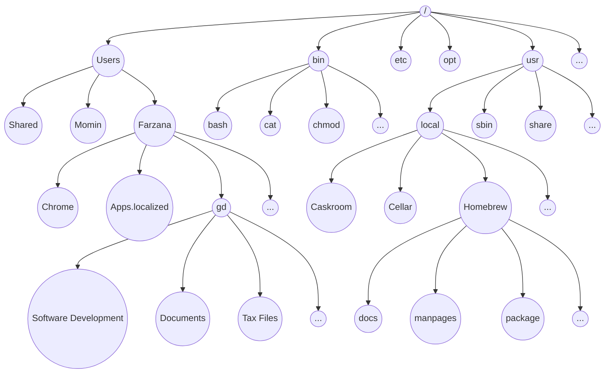
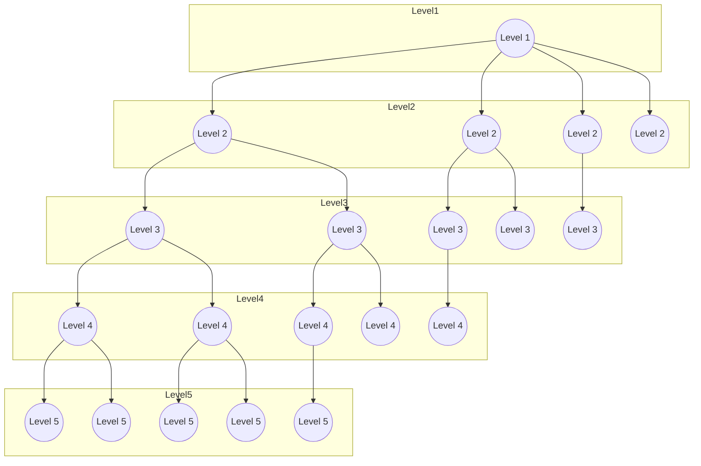

# Markdown Starter Worksheet

-   [Markdown Starter Worksheet](#markdown-starter-worksheet)
    -   [Useful VSCode Plugins](#useful-vscode-plugins)
        -   [Markdown All in One](#markdown-all-in-one)
        -   [Markdown Preview Enhancer](#markdown-preview-enhancer)
    -   [References and documentation:](#references-and-documentation)
    -   [Headers](#headers)
    -   [Quotes](#quotes)
    -   [Emphasis](#emphasis)
    -   [Horizontal Rule](#horizontal-rule)
    -   [Lists](#lists)
    -   [Links](#links)
    -   [Images](#images)
    -   [Code](#code)
    -   [Tables](#tables)
    -   [Custom HTML](#custom-html)
    -   [Custom CSS](#custom-css)
    -   [Additional Resources](#additional-resources)
        -   [Mermaid Graph](#mermaid-graph)

### Useful VSCode Plugins

#### [Markdown All in One](yzhang.markdown-all-in-one)

#### [Markdown Preview Enhancer](shd101wyy.markdown-preview-enhanced)

### References and documentation:

-   [R Markdown Cookbook](https://bookdown.org/yihui/rmarkdown-cookbook/)
-   [W3School](https://www.w3schools.io/file/markdown-introduction/)

-   `/Users/a.momin/.mume/style.less`
    -   styling sheet for markdown page in SVCode.

The main goal of MarkDown is to be easily written and easily read. It uses "plain text" formatting and can be converted to HTML. The most common use case I've come across to use Markdown is for ReadMe files, used, for example, for Github repos. Markdown can also be used to create email.

Markdown, in comparison to HTML, is much simpler to read and write. The average person can typically understand markdown and would be able to learn and write it much quicker than HTML.

Specifically, Visual Studio Code uses the [CommonMark](http://commonmark.org/) Markdown specification.

---

## Headers

Headers are defined by the '#'symbol. One '#' for H1, two for H2, etc.

> **TODO**:. Create an H1

> **TODO**:. Create an H2

> **TODO**:. Create an H3

> **TODO**:. Create an H4

---

## Quotes

Quotes are defined by the '>' symbol

> This is an example quote

> **TODO**:. Create a quote

You can combine a header with a quote.

> # H1 Quote

> **TODO**:. Create an H2 Quote

---

## Emphasis

Add emphasis with asterisks '\*' and underscores '\_'
Two before and after (no spaces) a section of texts makes it bold

**Bold Text with asterisks**
**Bold Text with underscores**

One before and after (no spaces) a section of texts makes it bold

_Italicized Text with asterisks_
_Italicized Text with underscores_

You can also put Bold and Italicized text inline by surrounding a group of words.

This text is **bold** and this text is _italicized_

> **TODO**:. Create a bold sentence, an italicized sentence, and a sentence with both bold and italicized text inline

## Horizontal Rule

A horizontal rule gives a visible line break. You can create one by putting three or more hypens, asterisks, or underscores (-, \*, \_).

For what it's worth, I prefer dashes...

---

---

---

> **TODO**: Create a horizontal rule

---

## Lists

Create unordered lists using '-', '\*', '+,

-   item

*   item

-   item

*   sdfsd

You can create sublists by indenting

-   item
    -   subitem

Create ordered lists using a number prefix

1. item 1
2. item 2
3. item 3

> **TODO**: Create an unordered list of your 5 favorite TV Shows

> **TODO**: Create an ordered list of your top 5 Movies

---

## Links

Create a link by surrounding it with angle bracket

<http://www.jamesqquick.com>

Create a link with text by surrounding text with brackets, [], and link immediately following with parenthesis ()

[James Q Quick](http://www.jamesqquick.com)

> **TODO**: Create a link to your website, twitter, or github. with no text

> **TODO**: Create a link with text to your website, twitter, or github

What if you needed to reuse a link several times? Well, you could copy and paste that link each time. That means, if you need to update the link, you will have to do it each time its used. There's a better way!

Create reference style links by defining your link with the a 'key' inside of brackets, colon, space, and the link

[1]: http://jamesqquick.com/

Then use the reference style link by using your text inside of brackets followed by the link 'key' inside of bracket.

[My Website][1]

> **TODO**: Create a reference link to your website and reference it three times

You can also link to other locations on your markdown page. Remember, your MarkDown will get converted to HTML, so you can, in theory, use a anchor tag to link to an element with a specific ID. You can find an example of this in the list of sections at the top of this document.

When we create a header tag for example, it implicitly creates an id property.

Ex '# Header' becomes `<h1 id="header">Header</h1>`

Names will be converted to ids by replacing spaces with hyphens and uppercase letters with lowercase letters (think css naming convention).

Ex 'Header Info' becomes header-info

> **TODO**: Create a link to another part of your page.

---

## Images

Defining an image is similar to defining a link, except you prefix it with '!'


Just like links, you can define images by reference in the same format.

Define the reference

[profile]: https://pbs.twimg.com/profile_images/887455546890211329/tAoS7KUm_400x400.jpg

Use the reference

![James Quick][profile]

> **TODO**: Create a reference link to your profile picture and then reference it.

---

## Code

You can do inline code with `backticks` (``)

> **TODO**: Display a line of text with inline code

You can do blocks of code by surroung it with 3 backticks (` `)

    ```
    var num = 0;
    var num2 = 0;
    ```

> **TODO**: Display a block of code from your favorite language

The above does not give language specific highlighting. You can specify the programming language immediately following the opening 3 backticks. You Should see a difference in highliting!

    ```javascript
    var num = 0;
    var num2 = 0;
    ```


    ```html
    <div>
        <p>This is an html example</p>
    </div>
    ```

> **TODO**: Display a block of code from your favorite language while specifying the language

---

## Tables

Tables are useful for displaying rows and columns of data. Column headers can be defined in between pipes (|). Headers are separated from table content with a row of dashes (-) (still separated by pipes), and there must be at least 3 dashes between each header. The row data follows beneath (still separated by pipes).

The column definitions and row definitions do not have to have the exact same width sizes, but it would be much more readable. Notice the output of the following two tables are the same, but the second (the raw markdown) is much more readable.

> **TODO**: Create a table with three columns and two rows

You can also align (Center, left, right) the text in a column by using colons (:) in the line breaks between headers and rows. No colon means the default **left alignment**. Colons on each side signifies **center alignment**. And a trailing colon means **right alignment**.

> **TODO**: Create a table with three columns, one aligned left, one aligned center, and one aligned right

| Header       |    Header 1    |      Header 2 |
| ------------ | :------------: | ------------: |
| Aligned Left | Aligned Center | Aligned Right |

| Header 1                 | Header 2              |
| ------------------------ | --------------------- |
| Loooooooooooooong item 1 | looooooooooong item 2 |

---

## Custom HTML

Since MarkDown gets automatically converted to HTML, you can add raw HTML directly to your MarkDown.

```html
<p>Sample HTML Div</p>
```

Creates this

<p>Sample HTML Div</p>

> **TODO**: If you are comfortable with HTML, add some raw HTML.

---

## Custom CSS

You can also add custom CSS to your MarkDown to add additional styling to your document. You can also include CSS by including a style tag.

```html
<style>
    body {
        color: red;
    }
</style>
```

> **TODO**: If you are comfortable with CSS, give your page some style.

---

## Additional Resources

-   [Markdown Cheat Sheet - Adam P on Github](https://github.com/adam-p/markdown-here/wiki/Markdown-Cheatsheet#images)
-   [Daring Fireball Markdown Syntax](https://daringfireball.net/projects/markdown/syntax)
-   [MarkDown in Visual Studio Code](https://code.visualstudio.com/docs/languages/markdown)

### Mermaid Graph



---

---


