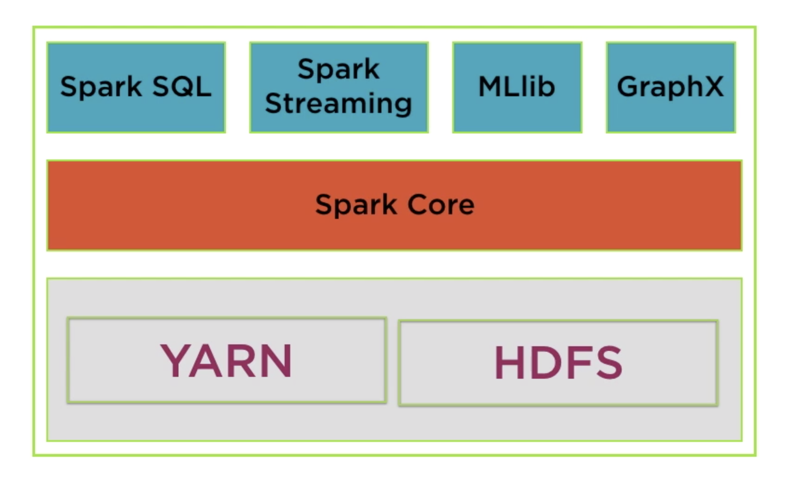
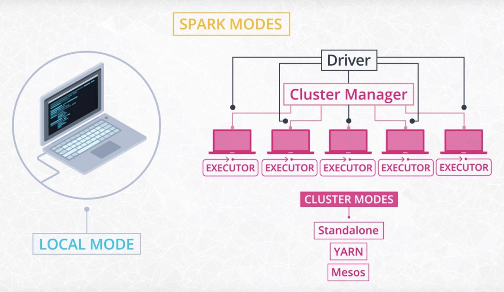
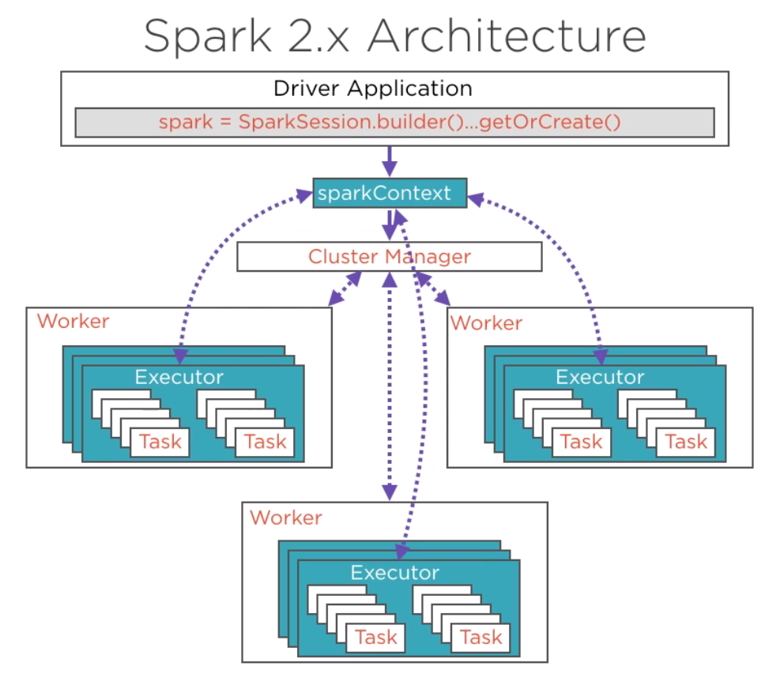
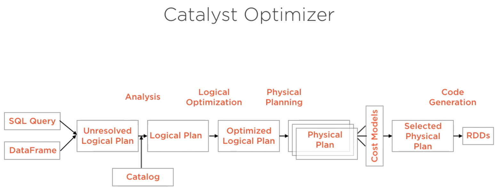
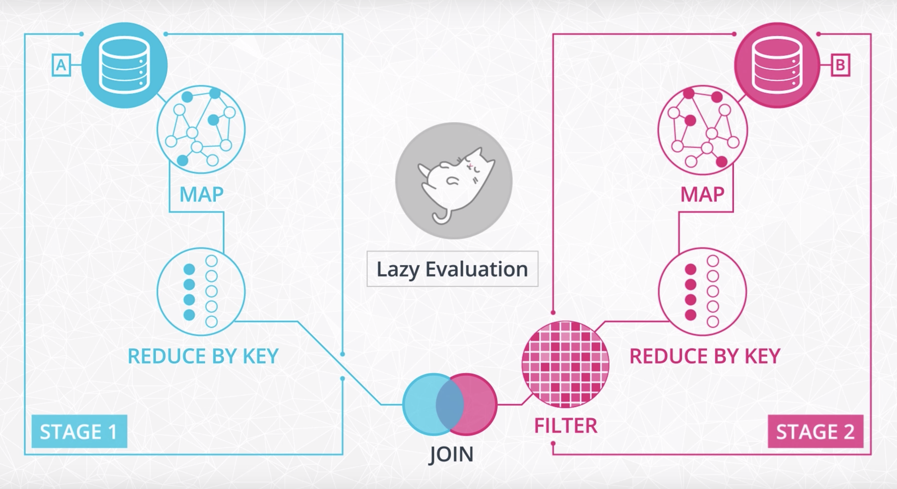
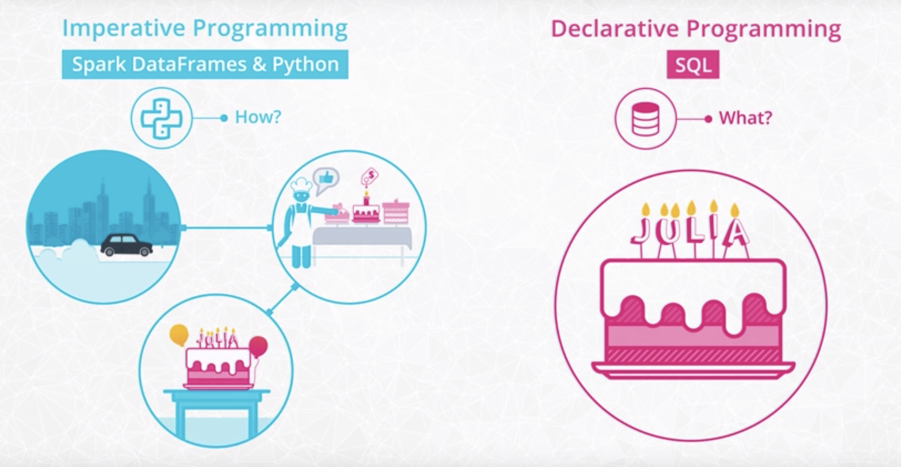
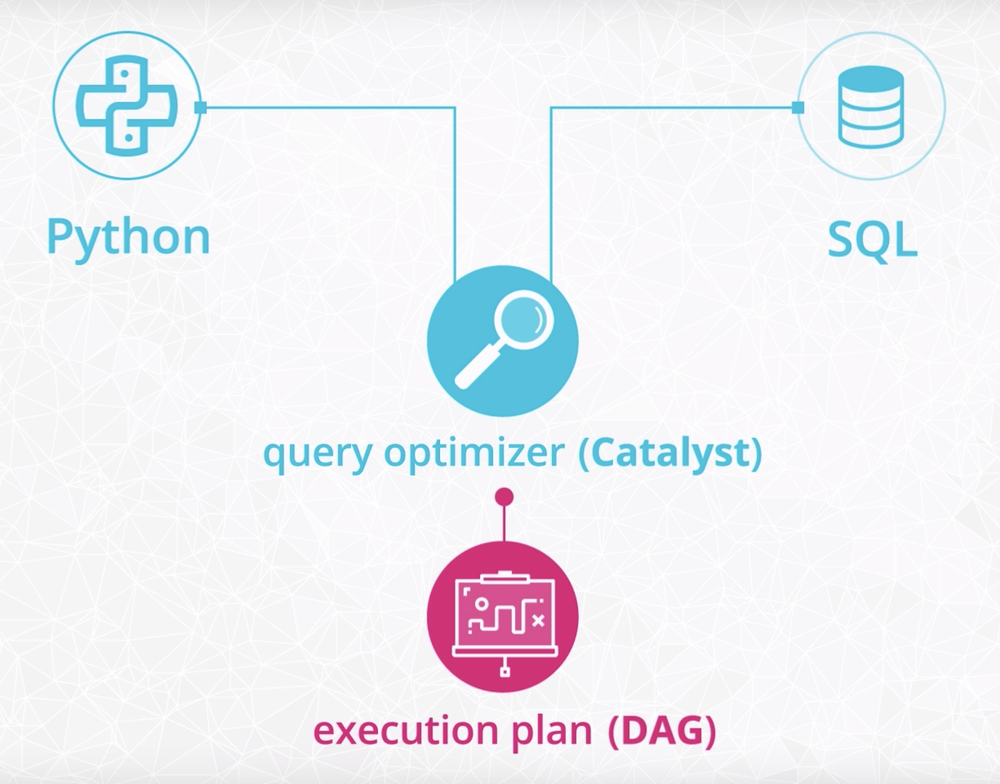
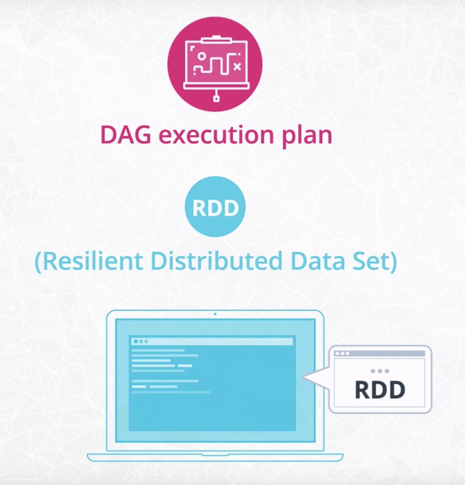
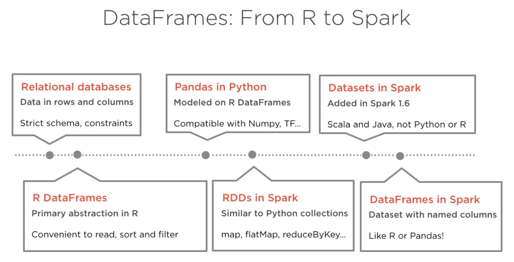

-   [Apache Spark Core—Deep Dive—Proper Optimization Daniel Tomes Databricks](https://www.youtube.com/watch?v=daXEp4HmS-E&t=291s)
-   [PySpark Tutorial for Beginners](https://www.youtube.com/playlist?list=PLwFJcsJ61ouiU1wvzzRk3pjU8xT9buJhr)
-   [YOUTUBE-VIDEO: Apache Spark Performance Tuning](https://www.youtube.com/playlist?list=PLWAuYt0wgRcLCtWzUxNg4BjnYlCZNEVth)
-   [From Query Plan to Performance: Supercharging your Apache Spark Queries using the Spark UI SQL Tab](https://www.youtube.com/watch?v=_Ne27JcLnEc)

---

#### MISC

-   Default partition size is 128 MB

---

<details><summary style="font-size:20px;color:Orange;text-align:left">Configurations</summary>

-   [Installation: Manually Downloading](https://spark.apache.org/docs/latest/api/python/getting_started/install.html#manually-downloading)

-   Prerequisites:

    -   Spark requires Java 8 or higher (`java -version`).

-   Download Spark:

    -   Go to the Apache Spark download page (https://spark.apache.org/downloads.html) and select the latest version of Spark.
    -   Choose the "Pre-built for Apache Hadoop" version.

-   Extract Spark:

    -   Extract the downloaded tar file using the follwoing command
    -   `$ tar -xvf spark-<version>-bin-hadoop<version>.tgz`

-   Configure Environment Variables:

    ```bash
        # Add required environment variable
        export SPARK_HOME=/path/to/your/spark-directory

        # Add Spark into your `PATH` variable
        export PATH=$SPARK_HOME/bin:$PATH
    ```

-   Standalone Cluster Configuration:

    -   In Spark, you can run in a standalone cluster mode. The default configuration file is spark-defaults.conf in the conf directory of the Spark installation.
    -   You may want to customize this configuration file for your needs. You can do this by copying the template and making adjustments:
    -   `$ cp $SPARK_HOME/conf/spark-defaults.conf.template $SPARK_HOME/conf/spark-defaults.conf`

-   Start the Master:

    -   To start the Spark Master, run the following command in your terminal:
    -   `$SPARK_HOME/sbin/start-master.sh`

-   Access the Web UI:

    -   You can access the Spark Master's web UI by opening a web browser and navigating to http://localhost:4040.

-   Start Worker Nodes:

    -   If you want to add worker nodes, you can start them by running:

    -   `$SPARK_HOME/sbin/start-worker.sh <master-url>`
        -   Replace <master-url> with the Spark Master's URL, which you can find in the web UI.

-   Run Spark Applications:

    -   You can submit Spark applications to your standalone cluster using the spark-submit command. For example:
    -   `$SPARK_HOME/bin/spark-submit --class your.spark.app.MainClass --master spark://<master-url> /path/to/your/app.jar`

-   Stop Spark Cluster:

    -   To stop the Spark Master and all associated worker nodes, use the following command:
    -   `$SPARK_HOME/sbin/stop-all.sh`

---

-   How to run Spark on Jupyter Notebook

    -   Install Jupyter Notebook:

        -   If you haven't already installed Jupyter Notebook, you can do so using pip. Open your terminal and run the following command:
        -   `$ pip install jupyter`

    -   Install PySpark:

        -   You need to install PySpark on your Mac. You can use pip to install it:
        -   `$ pip install pyspark`

    -   Set up Environment Variables:

        -   Before starting a Jupyter Notebook, make sure your Spark environment variables are correctly set. In your terminal, export the following environment variables:

        ```sh
        export PYSPARK_PYTHON="python3"
        export PYSPARK_DRIVER_PYTHON="jupyter"
        ```

</details>

---

<details><summary style="font-size:20px;color:Orange;text-align:left">Spark Terms and Concepts</summary>

1. **Apache Spark**:

    - Apache Spark is an open-source distributed computing system that provides a fast and general-purpose cluster-computing framework for big data processing.
    - Spark is designed for speed and ease of use, supporting various programming languages, including Python through PySpark.

2. **PySpark**:

    - PySpark is the Python API for Apache Spark, allowing developers to write Spark applications using Python.
    - It provides a high-level API for distributed data processing, enabling Python developers to harness the power of Spark for big data analytics.

3. **SparkContext**:

    - SparkContext is the entry point for any Spark functionality in a PySpark application.
    - It coordinates the execution of tasks across a cluster, manages resources, and establishes a connection to the Spark cluster.

4. **RDD (Resilient Distributed Dataset)**:

    - RDD is the fundamental data structure in Spark, representing an immutable distributed collection of objects.
    - RDDs support parallel processing and fault tolerance, allowing Spark to efficiently distribute data across a cluster.

5. **DataFrame**:

    - DataFrame is a distributed collection of data organized into named columns, similar to a table in a relational database.
    - It provides a more user-friendly, structured API for data manipulation and analysis compared to RDDs, and it integrates well with Python's Pandas library.

6. **SparkSession**:

    - SparkSession is the entry point for DataFrame and SQL functionality in Spark, combining the features of SQLContext and HiveContext.
    - It simplifies the process of working with DataFrames and provides a unified interface for interacting with structured and semi-structured data.

7. **Transformations**:

    - Transformations are operations on RDDs or DataFrames that produce a new RDD or DataFrame.
    - Transformations are lazily evaluated, and they define the sequence of operations to be performed on the data.
    - Transformations in Spark are categorized into two types based on their behavior.

    - `Narrow Transformations`:

        - Narrow transformations are transformations where each partition of the parent RDD contributes to only one partition of the child RDD.
        - These transformations do not require shuffling of data between partitions. Each partition of the resulting RDD depends on one partition of the parent RDD.
        - Example: map, filter, union, distinct, flatMap, etc.

    - `Wide Transformations`:

        - Wide transformations are transformations where each partition of the parent RDD can contribute to multiple partitions of the child RDD. They involve shuffling of data across partitions.
        - These transformations require data to be redistributed and shuffled across partitions. They involve a more significant amount of data movement between nodes.
        - Example: groupByKey, reduceByKey, sortByKey, join, cogroup, distinct after a repartition, etc.

    - `Differences`:

        - Narrow transformations are more efficient as they do not require data shuffling, and the computation can be performed independently on each partition.
        - Wide transformations involve data shuffling, which can be a costly operation in terms of performance.
        - Narrow transformations result in a one-to-one mapping of partitions from the parent to the child RDD.
        - Wide transformations may result in a different number of partitions in the child RDD compared to the parent RDD.

8. **Actions**:

    - Actions are operations on RDDs or DataFrames that trigger the execution of transformations and return a result to the driver program or write data to an external storage system.
    - Actions are the operations that initiate the actual computation and produce results.

9. **Partitioning**:

    - Partitioning is the process of dividing a large dataset into smaller, manageable pieces called partitions.
    - Proper partitioning is crucial for achieving parallelism and efficient data processing across a cluster.

10. **Broadcast Variables**:

    - Broadcast variables are read-only, cached variables that are efficiently distributed to all worker nodes in a Spark cluster.
    - They are used to efficiently share large read-only variables, reducing the overhead of sending data over the network.

11. **Accumulators**:

    - Accumulators are variables that can be used to accumulate values across multiple tasks in parallel.
    - They provide a convenient way to implement counters and sums in a distributed computing environment.

12. **Caching and Persistence**:

    - Caching involves persisting an RDD or DataFrame in memory or on disk to avoid recomputation.
    - Caching is useful for iterative algorithms and operations that are repeatedly used, improving overall performance.

13. **Shuffle Operation**:

    - A shuffle operation is a data exchange operation that redistributes data across partitions.
    - Shuffles are resource-intensive and can impact performance, so optimizing and minimizing shuffle operations is crucial.

14. **Spark Libraries**:

    - Spark includes various libraries such as Spark SQL, MLlib (machine learning), GraphX (graph processing), and Spark Streaming (real-time data processing).
    - These libraries extend Spark's capabilities, making it suitable for a wide range of big data processing tasks.

15. **Cluster Manager**:

    - A cluster manager is responsible for allocating resources and managing the execution of Spark applications across a cluster of machines.
    - Common cluster managers include Apache Mesos, Apache Hadoop YARN, and Spark's standalone cluster manager.

16. **Executor**:

    - An executor is a process launched for an application on a worker node, responsible for executing tasks and storing data in memory or on disk.
    - Executors are the units of computation and storage in a Spark application.

17. **Driver Program**:

    he "Driver Program" plays a central role in managing the execution of Spark applications. Here are key points about the Driver Program:

    - `Control Center`:

        - The Driver Program is the main control program that manages the execution of a Spark application.
        - It defines the high-level control flow and coordinates the execution of tasks across the cluster.

    - `User Code Execution`:

        - The Spark application code, written by the user, is executed in the Driver Program.
        - This code includes defining transformations and actions on distributed datasets.

    - `Job Submission`:

        - The Driver Program submits Spark jobs to the cluster for execution.
        - Each job represents a sequence of transformations and actions on the data.

    - `Spark Context`:

        - The Driver Program initializes and maintains the Spark Context, which is the entry point for interacting with Spark functionality.
        - Spark Context is used to create RDDs (Resilient Distributed Datasets), broadcast variables, and perform other Spark-related operations.

    - `Task Scheduling`:

        - The Driver Program breaks down Spark jobs into stages, and stages into tasks.
        - It schedules the execution of tasks on the executor nodes in the cluster.

    - `Results Aggregation`:

        - The Driver Program aggregates and collects results from the tasks executed on the executor nodes.
        - It manages the overall execution and collects final results for actions, such as collect().

    - `Fault Tolerance`:

        - The Driver Program is responsible for handling failures and ensuring fault tolerance.
        - It keeps track of the lineage information of RDDs to recover lost data in case of node failures.

    - `Communication`:

        - The Driver Program communicates with the Cluster Manager (e.g., Spark Standalone, Apache Mesos, or Apache YARN) to acquire resources and manage task execution.

    - `Lifecycle Management`:

        - The Driver Program manages the entire lifecycle of the Spark application, from initialization to execution and termination.

    - `Driver UI`:

        - The Driver Program provides a web-based user interface (UI) that allows monitoring and tracking the progress of the Spark application.

18. **Job**:

    - A job in Spark represents a complete computation with a specific goal.
    - It is a sequence of transformations and actions on data that is executed to produce a result.
    - A Spark application can consist of one or more jobs.

19. **Stage**:

    - A job is divided into stages based on the presence of a shuffle operation (e.g., a reduce operation).
    - A stage represents a set of tasks that can be executed in parallel.
    - A stage consists of tasks that perform the same computation but on different partitions of the data.

20. **Task**:

    - A task is the smallest unit of work in Spark and represents the execution of a computation on a single partition of data.
    - Tasks are the actual computations that are performed on the executor nodes.
    - Each stage is divided into tasks, and tasks within a stage can be executed in parallel.

</details>

---

<details><summary style="font-size:20px;color:Orange;text-align:left">Shuffle Operations</summary>

In Apache Spark, a "shuffle" operation refers to the process of redistributing and reorganizing data across the partitions of a Resilient Distributed Dataset (RDD) or DataFrame. Shuffling is a critical operation in distributed data processing, especially when certain transformations require data to be rearranged or grouped differently. Shuffling involves substantial data movement across the nodes of a Spark cluster and is generally considered an expensive operation.

**Key Concepts Related to Shuffle Operations**

-   `Stages`:

    -   Shuffling often occurs as part of a Spark job during the transition between stages.
    -   A stage is a set of parallel tasks that can be executed without data exchange, and shuffling typically separates different stages.

-   `Map and Reduce Phases`:

    -   The shuffle process is often divided into two main phases: map and reduce.
    -   In the map phase, data is locally processed on each executor to prepare it for the shuffle.
    -   In the reduce phase, the shuffled data is aggregated and combined across the cluster.

**Shuffle Components**

-   `Map Side`:

    -   Map Tasks: The initial processing tasks that occur on each executor.
    -   Partitioning: Data is partitioned based on a partitioning function, and each partition is sent to a corresponding reducer.
    -   Serialization: Data is serialized for transmission to the reducers.

-   `Shuffle Manager`:

    -   Shuffle Write: Handles the writing of map output data to disk or memory for transmission.
    -   Shuffle Fetch: Manages the retrieval of shuffled data by reducers.

-   `Reduce Side`:

    -   Reduce Tasks: Process the shuffled data and perform the final aggregation.
    -   Deserialization: Shuffled data is deserialized for further processing.

**Detailed Steps in a Shuffle Operation**

-   `Map Phase`:

    -   Each executor performs local processing on its partition of data.
    -   Data is partitioned based on a partitioning function, which determines which reducer will receive each record.
    -   Map output records are written to local disk or memory, typically in the form of map output files.

-   `Shuffle Write`:

    -   Map output files are transferred to the nodes where the reducers are running.
    -   These files are stored in the shuffle manager's directory, which is accessible by all nodes in the cluster.
    -   Data is sorted and partitioned according to the partitioning function.

-   `Shuffle Fetch`:

    -   Reducers pull the relevant map output data from the shuffle manager's directory.
    -   This involves a network transfer of data from multiple nodes to the reducers.

-   `Reduce Phase`:

    -   Reducers perform the final aggregation and processing on the shuffled data.
    -   Results are written to the final output.

**Optimization Techniques**

-   `Speculative Execution`:

    -   Spark can identify slow-running tasks and launch backup or speculative tasks on other nodes to mitigate stragglers.

-   `Partitioning Strategies`:

    -   Choosing an appropriate partitioning strategy is crucial for efficient shuffling.
    -   Custom partitioners can be implemented to optimize data distribution.

-   `Compression`:

    -   Compression can be applied to reduce the amount of data transferred during the shuffle phase, minimizing network overhead.

-   `Caching`:

    -   Caching intermediate results or frequently accessed data can reduce the need for recomputation and subsequent shuffling.

**Common Operations Triggering Shuffling**

-   `GroupByKey`:

    -   When using the groupByKey transformation, data with the same key needs to be grouped together, requiring shuffling.

-   `ReduceByKey`:

    -   Similar to groupByKey, reduceByKey involves shuffling data to perform reduction operations.

-   `Join` Operations:

    -   Joining two RDDs or DataFrames based on a common key involves shuffling data between nodes.

-   `Aggregations`:

    -   Operations like reduce or aggregate that require combining data across partitions trigger shuffling.

Shuffling is a fundamental aspect of distributed data processing in Apache Spark. While it is necessary for certain operations, developers should be mindful of its performance implications and employ optimization strategies to minimize its impact on job execution time and resource utilization.

</details>

---

<details><summary style="font-size:20px;color:Orange;text-align:left">Broadcast Variables and Accumulator</summary>

In Apache Spark, Broadcast and Accumulator are two important concepts used for efficient and distributed data processing. They serve distinct purposes in Spark applications. Let's delve into each of them in detail:

-   `Broadcast Variable`: A Broadcast variable is a read-only, efficient, and distributed mechanism in Spark used for sharing large data or read-only variables across all worker nodes in a cluster. It's particularly useful when you want to reuse the same variable across multiple tasks without sending it over the network multiple times. Broadcast variables are a form of a shared, in-memory cache for data that needs to be reused by tasks.

    -   `Creation`: You create a Broadcast variable from a driver program by calling the SparkContext.broadcast() method. The variable is typically an immutable data structure.

    -   `Distribution`: Spark distributes the Broadcast variable to all worker nodes in the cluster. It ensures that each worker has a copy of the variable in its memory.

    -   `Task Access`: Tasks running on worker nodes can access the Broadcast variable locally, as it's already available in their memory. This eliminates the need to send the data over the network repeatedly.

    -   `Efficiency`: Broadcast variables help in optimizing performance by reducing data transfer overhead, especially when the same data is needed across multiple tasks.

    -   `Use Cases`: Common use cases for Broadcast variables include sharing reference data, dictionaries, lookup tables, or any large read-only data that's used by multiple tasks.

-   `Accumulator`: An Accumulator is another distributed data structure in Spark, but it's designed for accumulating values in parallel across worker nodes. Accumulators are typically used for implementing counters and aggregations in a distributed and fault-tolerant manner. They can only be "added" to and are initialized on the driver, but the value can be read by the driver at any point.

    -   `Creation`: You create an Accumulator on the driver program using the SparkContext.accumulator() method. The initial value is set at this stage.

    -   `Distribution`: The Accumulator is distributed to worker nodes, but workers can only "add" values to it. They cannot read or modify the accumulator's value directly.

    -   `Task Updates`: During the execution of tasks on worker nodes, the tasks can update the Accumulator by adding values to it. These updates are automatically merged in a distributed and fault-tolerant manner.

    -   `Driver Access`: The driver can read the final value of the Accumulator once all tasks are complete. This final value reflects the accumulated result from all tasks.

    -   `Use Cases`: Accumulators are suitable for tasks that require distributed aggregation, such as counting occurrences of events across a large dataset.

In summary, Broadcast variables are used for efficiently sharing read-only data across worker nodes, while Accumulators are used for accumulating values across tasks in a distributed and fault-tolerant manner. Both Broadcast and Accumulator are essential tools for performing distributed data processing and aggregation in Spark applications, enhancing efficiency and performance.

</details>

---

<details><summary style="font-size:20px;color:Orange;text-align:left">Grouping and Aggregating</summary>

-   How does the grouping and aggregating works in a cluster mode Spark operation is done simultaniously?

In Apache Spark, grouping and aggregating operations in cluster mode are designed to work simultaneously through a process known as parallel processing. Let's break down how this happens:

**Partitioned Processing**: Spark divides the data into partitions, and each partition is processed independently on different nodes in the cluster. This is the foundation of parallel processing.

**Grouping within Partitions**: Within each partition, Spark performs the grouping operation based on the specified key or keys. This step is done independently in each partition.

**Aggregation within Partitions**: After grouping, if there are aggregation functions specified (e.g., counting, summing), Spark performs these aggregations within each partition. Again, this is done in parallel for each partition.

**Combining Results**: The intermediate results (grouped and aggregated data within each partition) are then combined. If the grouping involved a shuffle operation (repartitioning the data based on keys), Spark takes care of redistributing the data so that records with the same key end up in the same partition.

**Final Aggregation (if needed)**: Once the data is reshuffled, Spark performs a final aggregation step if there are global aggregations across all partitions.

</details>

---

<details><summary style="font-size:20px;color:Orange;text-align:left">Spark</summary>

### 1.1. Spark vs. Hadoop

-   Hadoop is an older system than Spark but is still used by many companies.

-   The major difference between Spark and Hadoop is how they use memory. Hadoop writes intermediate results to disk whereas Spark tries to keep data in memory whenever possible. This makes Spark faster for many use cases. Spark does in memory distributed data analysis, in order to make jobs faster.

-   While Spark is great for iterative algorithms, there is not much of a performance boost over Hadoop MapReduce when doing simple counting. Migrating legacy code to Spark, especially on hundreds of nodes that are already in production, might not be worth the cost for the small performance boost.

-   Spark does not include a file storage system. You can use Spark on top of HDFS but you do not have to. Spark can read in data from other sources as well such as [Amazon S3](https://aws.amazon.com/s3/).

### 1.2. Spark ecosystem

<center></center>

-   Spark core: General purpose computing engine
-   YARN: Cluster manager. Alternatives: Mesos, Spark Standalone
-   HDFS: Distributed storage system
-   Spark libraries

    -   Streaming data

        -   The use case is when you want to store and analyze data in real-time such as Facebook posts or Twitter tweets.

        -   Spark has a streaming library called [Spark Streaming](https://spark.apache.org/docs/latest/streaming-programming-guide.html) although it is not as popular and fast as some other streaming libraries. Other popular streaming libraries include [Storm](http://storm.apache.org/) and [Flink](https://flink.apache.org/).

### 1.3. Four different modes to setup Spark

-   Local mode - prototype

      <center></center>

-   Other three modes - distributed and declares a cluster manager.

### 1.4. Spark use cases

Here are a few resources about different Spark use cases.

-   [Data Analytics](http://spark.apache.org/sql/)
-   [Machine Learning](http://spark.apache.org/mllib/)
-   [Streaming](http://spark.apache.org/streaming/)
-   [Graph Analytics](http://spark.apache.org/graphx/)

### 1.5. You don't always need Spark

-   Spark is meant for big data sets that cannot fit on one computer. But you don't need Spark if you are working on smaller data sets.

-   Sometimes, you can still use pandas on a single, local machine even if your data set is only a little bit larger than memory. E.g., `pandas` can read data in chunks.

-   If the data is already stored in a relational database, you can leverage SQL to extract, filter and aggregate the data. If you would like to leverage `pandas` and SQL simultaneously, you can use libraries such as `SQLAlchemy`, which provides an abstraction layer to manipulate SQL tables with generative Python expressions.

-   The most commonly used Python Machine Learning libraries are `scikit-learn` and `TensorFlow` or `PyTorch`.

### 1.6. Spark's limitations

-   For streaming data, Spark is slower than native streaming tools such as [Storm](http://storm.apache.org/), [Apex](https://apex.apache.org/), and [Flink](https://flink.apache.org/).

-   For machine learning, Spark has limited selection of machine learning algorithms. Currently, Spark only supports algorithms that scale linearly with the input data size. In general, deep learning is not available either, though there are many projects integrate Spark with Tensorflow and other deep learning tools.

### 1.7. Beyond Spark for Storing and Processing Big Data

-   Spark is not a data storage system, and there are a number of tools besides Spark that can be used to process and analyze large datasets.

-   Sometimes it makes sense to use the power and simplicity of SQL on big data. For these cases, a new class of databases, know as NoSQL and NewSQL, have been developed. E.g., newer database storage systems like [HBase](https://hbase.apache.org/) or [Cassandra](http://cassandra.apache.org/); distributed SQL engines like [Impala](https://impala.apache.org/) and [Presto](https://prestodb.io/). Many of these technologies use query syntax.

## 2. Spark architecture and functional programming

Spark is written in Scala, which is a functional programming. There are application programming interfaces in Java, R, Python; e.g. Python API - `PySpark`

### 2.1. Spark architecture

<center></center>

Spark cluster is set up in the classic master/worker configuration. The master node coordinates all processes that run on worker nodes.

-   The master node runs a **Driver** program, which is a separate JVM process.

    -   The driver program is responsible for **launching tasks**, which run on individual worker node. These tasks operate on subsets of RDDs (see Section 2.6. below) that are present on that node.
    -   The driver program hosts **SparkContext**, which is the gateway to any Spark application.
    -   The driver program run several groups of **services**
        -   SparkEnv
        -   DAGScheduler
        -   Task Scheduler
        -   SparkUI
        -   ...

-   The **Spark Application** is instantiated within the Driver program.

    -   Uses SparkContext as entry point to start a Spark Application.
    -   The Application will read data, perform a series of transformations and actions. These operations are represented in the form of a Directed Acyclic Graph (DAG) of RDDs.
    -   Internally, Spark creates **Stages** (physically execution plan). Multiple logical operations may be grouped together into a single physical stage, so each Stage is split into operations on RDD partitions called **Tasks**. These tasks are made up of the actual transformations and actions specified in the code.

-   **Execution** in Spark 2 has significant performance optimization

    -   Performance optimization is powered by the 2nd generation **Tungsten engine**, which introduces optimizations in Spark to make the Spark engine compute much faster:

        -   Eliminate virtual function calls
        -   Store data in registers, not RAM/cache
        -   Perform compiler optimization, e.g. loop unrolling. pipelining

    -   **Catalyst optimizer** is the optimization engine that powers Spark SQL as well as DataFrame API

        <center></center>

        -   SQL query and DataFrame: relations to be processed
        -   Unresolved logical plan: unresolved as column types and existence yet to be ascertained
        -   Catalog: tracks tables in all data sources to resolve plan
        -   Logical plan: output of the analysis phase
        -   Optimized logical plan: optimize costs of predicate pushdown, projection pruning, null propagation, expression simplification
        -   Physical plan: generate different alternative physical plans for this optimized logical plan. Here Catalyst interfaces with the Spark execution engine Tungsten
        -   Cost models: apply cost models to find the best physical plan
        -   Selected physical plan: generate Java bytecode to run on each machine

-   **SparkContext**, hosted by the Driver program, is the entry point to Spark application

    -   Interact with all the Spark constructs for distributed data processing, e.g. create RDDs, accumulators, and run jobs
    -   SparkContext is wrapped in SparkSession that encapsulates SQLContext, HiveContext, etc.

-   **Cluster manager**

    -   The cluster manager is a separate process that monitors the available resources, and makes sure that all machines are responsive during the job.
    -   3 different options of cluster managers
        -   Standalone cluster manager
        -   YARN (from Hadoop)
        -   Mesos (open source from UC Berkeley's AMPLab Coordinators)

-   **Workers**

    -   Compute nodes in cluster that are responsible for running the Spark application code
    -   When SparkContext is created, each worker starts executors
        -   **Executors**: distributed agents that execute tasks - the basic units of execution

### 2.2. Functional programming

-   **Functional programming** is the process of building software by composing **pure functions**, avoiding **shared state**, **mutable data**, and **side-effects**.

    -   **Pure functions:** functions that preserve inputs and avoid side effects.

    -   **Function composition:** the process of combining two or more functions in order to produce a new function or perform some computation.

    -   When you avoid **shared state**, the timing and order of function calls don’t change the result of calling the function. With pure functions, given the same input, you’ll always get the same output.

    -   **Mutable data:** no property can change, regardless of the level of the property in the object hierarchy

    -   **Side-effects:** any application state change that is observable outside the called function other than its return value.

### 2.3. Directed Acyclic Graph (DAG)

Spark features an advanced Directed Acyclic Graph (DAG) engine supporting cyclic data flow. Each Spark job creates a DAG of task stages to be performed on the cluster.

-   In lazy evaluation, data is not loaded until it is necessary.

      <center></center>

-   Compared to MapReduce, which creates a DAG with two predefined stages - Map and Reduce, DAGs created by Spark can contain any number of stages.

### 2.4. Maps and lambda functions

In Spark, maps take data as input and then transform that data with whatever function you put in the map. They are like directions for the data telling how each input should get to the output.

-   Create a `SparkContext` object

    With the `SparkContext`, you can input a dataset and parallelize the data across a cluster. If using Spark in local mode on a single machine, technically the dataset isn't distributed yet.

    ```python
    # The findspark Python module makes it easier to install
    # Spark in local mode on your computer. This is convenient
    # for practicing Spark syntax locally.
    import findspark
    findspark.init('spark-2.3.2-bin-hadoop2.7')

    # Instantiate a SparkContext object
    import pyspark
    sc = pyspark.SparkContext(appName="maps_and_lazy_evaluation_example")

    # Read in the log_of_songs list into Spark
    log_of_songs = [
        "Despacito",
        "Nice for what",
        "No tears left to cry",
        "Despacito",
        "Havana",
        "In my feelings",
        "Nice for what",
        "despacito",
        "All the stars"
    ]

    # parallelize the log_of_songs to use with Spark
    distributed_song_log = sc.parallelize(log_of_songs)
    ```

-   Convert to lowercase

    ```python
    # Define a function
    def convert_song_to_lowercase(song):
        return song.lower()

    # Apply this function using a map step
    distributed_song_log.map(convert_song_to_lowercase)
    # Due to lazy evaluation, Spark does not actually
    # execute the map step unless it needs to.

    # Can also use anonymous (lambda) functions as well
    # as built-in Python functions like string.lower().
    distributed_song_log.map(lambda x: x.lower()).collect()

    # Get Spark to actually run the map step.
    distributed_song_log.map(convert_song_to_lowercase).collect()
    # The collect() method takes the results from all
    # of the clusters and "collects" them into a single
    # list on the master node.
    ```

    Spark is not changing the original data set: Spark is merely making a copy.

### 2.5. Imperative vs declarative programming

-   How to achieve the result vs. what result to get

      <center></center>

### 2.6. Resilient distributed dataset (RDD)

-   **RDD** is a fundamental data structure of Spark. It is an **immutable distributed collection of objects** (rows, records). RDDs are a low-level abstraction of the data. You can think of RDDs as long lists distributed across various machines. You can still use RDDs as part of your Spark code although data frames and SQL are easier.

      <center></center> <br>
      <center></center>

-   Characteristic of RDDs

    -   **Partitioned**: Split across data nodes in a cluster

        -   Processing occurs on nodes in parallel
        -   Data is stored in memory for each node in the cluster

    -   **Immutable**: RDDs, once created, cannot be changed. RDDs support only 2 types of operations:

        -   **Transformation**: transformation into another RDD. Transformations are executed only when a result is requested
        -   **Action**: Request a result

            Lazy evaluation: Spark keeps a record of the series of transformations rquested by the user. It groups the transformations in an efficient way when an Action is requested.

    -   **Resilient**: Can be reconstructed even if a node crashes.

        -   RDDs can be created in 2 ways:

            Reading a file <br>
            Transforming another RDD

        -   Spark tracks the source and every transformation that led to the current RDD, aka., the **lineage** of RDD. The lineage allows RDDs to be (1) reconstructed when nodes crash, and (2) lazily instantiated (materialized) when accessing the results.

-   Additional resources

    -   Explanation of the difference between RDDs and DataFrames in Databricks' [A Tale of Three Apache Spark APIs: RDDs, DataFrames, and Datasets](https://databricks.com/blog/2016/07/14/a-tale-of-three-apache-spark-apis-rdds-dataframes-and-datasets.html) blog post.

    -   Link to the Spark documentation's [RDD programming guide](https://spark.apache.org/docs/latest/rdd-programming-guide.html).

### 2.7. RDDs, Datasets, and DataFrames

-   DataFrame

      <center></center>

    -   Built on top of RDDs
    -   Each row represents 1 observation

-   Comparison

    | RDDs                                      | Datasets                                                             | DataFrames                                                                       |
    | ----------------------------------------- | -------------------------------------------------------------------- | -------------------------------------------------------------------------------- |
    | Primary abstraction since initial version | Added to Spark in 1.6                                                | Added to Spark in 1.3                                                            |
    | Immutable and distributed                 | Immutable and distributed                                            | Immutable and distributed                                                        |
    | Strong typing, use of lambda              | Supports strong typing, lambda                                       |                                                                                  |
    | No optimized execution                    | Leverage optimizers in recent versions                               |                                                                                  |
    | Available in all languages                | Present in Scala and Java, not Python or R                           | Available in all languages                                                       |
    |                                           | No named columns                                                     | Named columns, like Pandas or R                                                  |
    |                                           | Extension of DataFrames: type-safe, OOP interface                    | Conceptually equal to a table in a relational database management system (RDBMS) |
    |                                           | Compile-time type safety                                             | No type safety at compile time                                                   |
    |                                           | Datasets of the `Row()` object in Scala/Java often called DataFrames | Equivalent to `Dataset<Row>` in Java or `Dataset[Row]` in Scala                  |

    Starting from Spark 2.0, APIs for Datasets and DataFrames have merged
